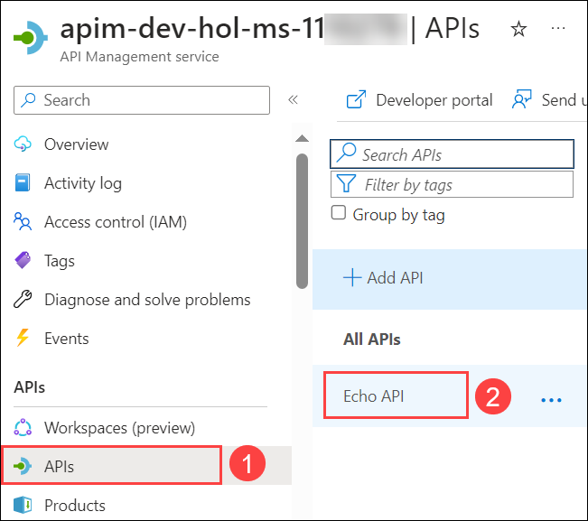
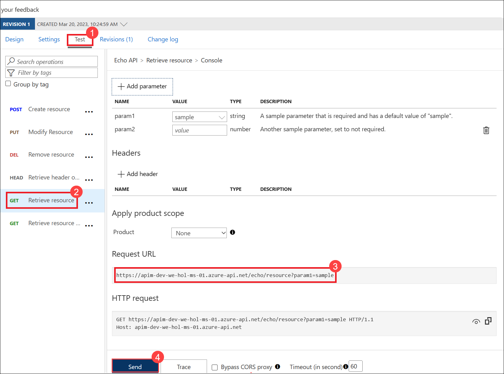
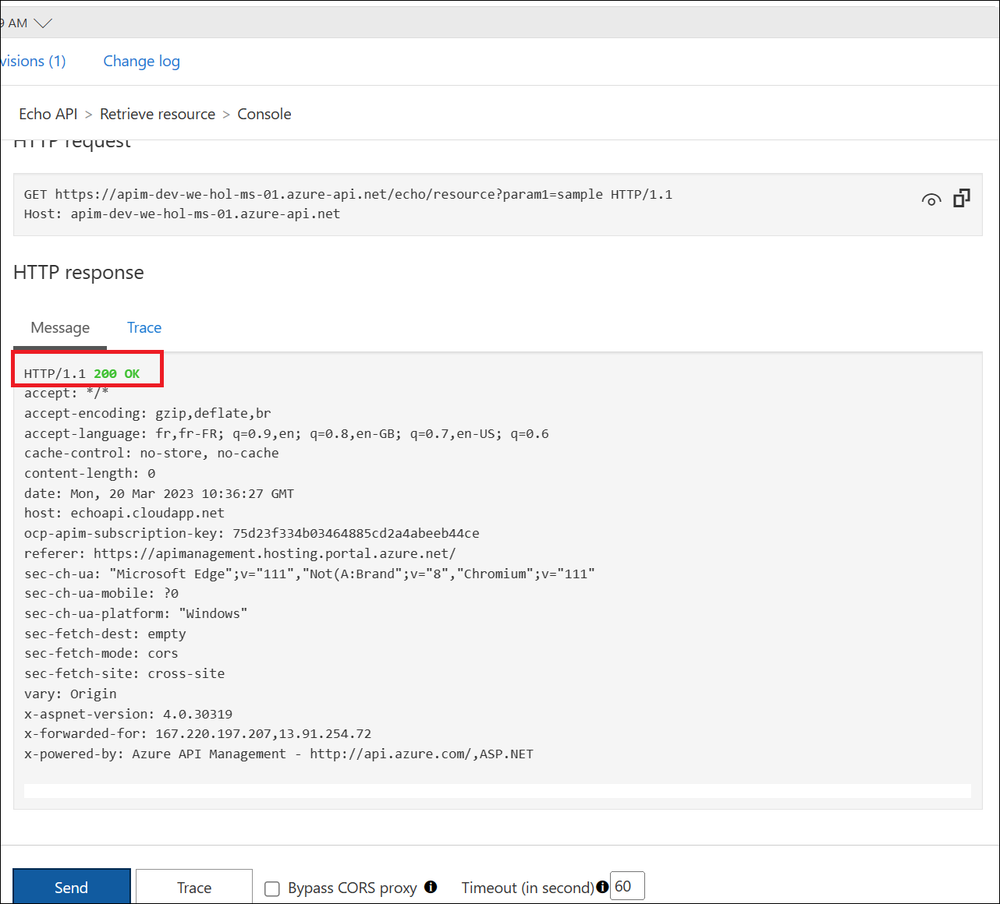
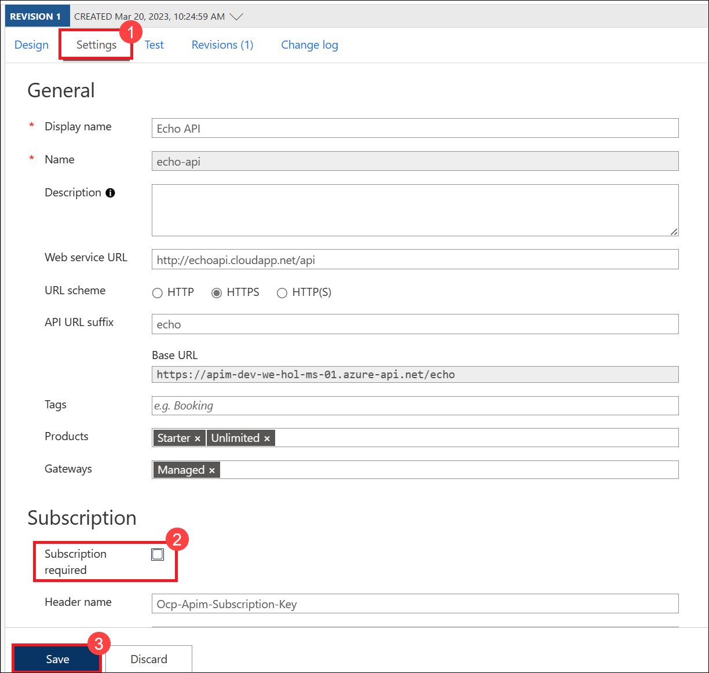
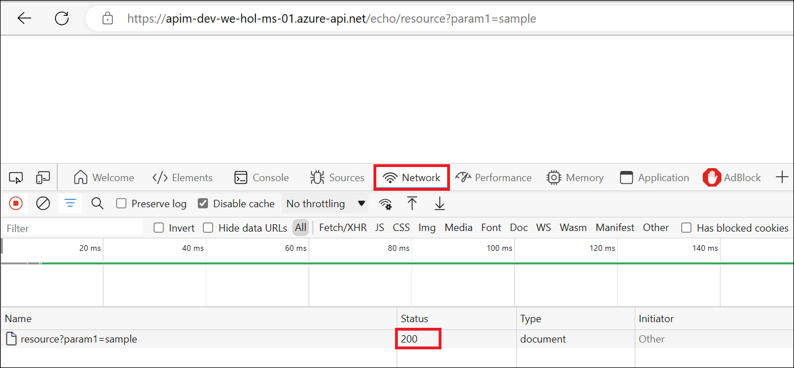
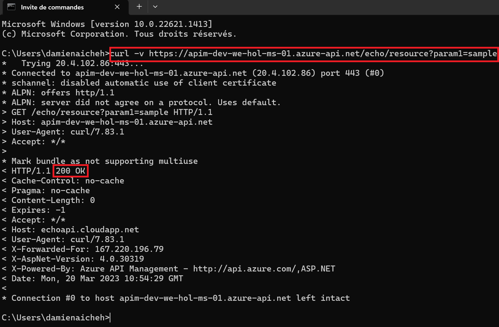

# Exercise 1: Create an API Management instance

## Overview

APIs enable digital experiences, simplify application integration, underpin new digital products, and make data and services reusable and universally accessible. With the proliferation and increasing dependency on APIs, organizations need to manage them as first-class assets throughout their lifecycle.
Azure API Management helps customers meet these challenges:

- Abstract backend architecture diversity and complexity from API consumers
- Securely expose services hosted on and outside of Azure as APIs
- Protect, accelerate, and observe APIs
- Enable API discovery and consumption by internal and external users

## Lab objectives

You will be able to complete the following tasks:

**Task 1**: Verifying the Azure API Management instance

## Task 1: Verifying the Azure API Management instance

Azure API Management instance has already been pre-deployed as part of the deployment for this lab.

1) Navigate to the **resource groups** in the Azure Portal and select the **apim-rg** resource group.

   

2) On the resource groups **apim-rg**, select API Management service resource type with name **apim-dev-hol-ms-<inject key="Deployment ID" enableCopy="false" />** . 
   
   
   
   Please verify that the Azure API Management instance functions correctly by following these steps:

1) Navigate to the Azure API Management instance in the Azure Portal.  
2) Select the **APIs (1)** blade, then select the ***Echo API (2)***.

     

4) Press the **Test (1)** tab, then select the **GET Retrieve resource (2)** operation and note the **Request URL (3)** in a text editor for later use.  
5) Press **Send (4)** to issue a simple request.  

     

6) Scroll down and observe the `200` Success HTTP response.  

     

At this time you have successfully verified that Azure API Management is set up!

## Verification Failure (and Path to Success)

You may have noticed the *Request URL* and may be tempted to put it in your browser, issue a CURL statement, etc. If you do, you may see a `401` error and wonder what's happening.

   

1. The reason for this unauthorized access status code is that the *Echo API* requires a subscription key to be set. Whereas tests originating in Azure API Management account for this automatically, external callers cannot (and, naturally, should not).

1. Navigate back to APIM in the portal, switch to the **Settings (1)** tab, uncheck **Subscription required (2)**, and press **Save (3)** at the bottom of the page.

1. Subscriptions are important and useful, but in this case, we just want to verify the Azure API Management instance is working as intended.

   

1. Now there should be no error when you access the link in your browser. In fact, in order to verify the 200, it's easiest to open your Developer Tools (F12), navigate to the **Network** tab, and look at **All** requests to see the 200.

   

1. Alternatively, open the command prompt and you can issue a verbose (`-v`) CURL command against the **Echo API** and observe the `200` Success:

   - **curl -v https://apim-dev-hol-ms-<inject key="Deployment ID" enableCopy="false" />.azure-api.net/echo/resource?param1=sample**

      

## Summary
In this exercise, you have verified the Azure API management instance. Now, click on Next from the lower right corner to move on to the next page.
