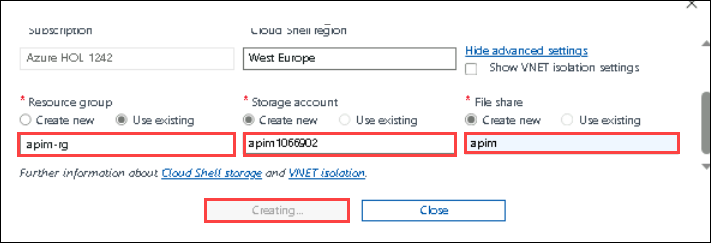
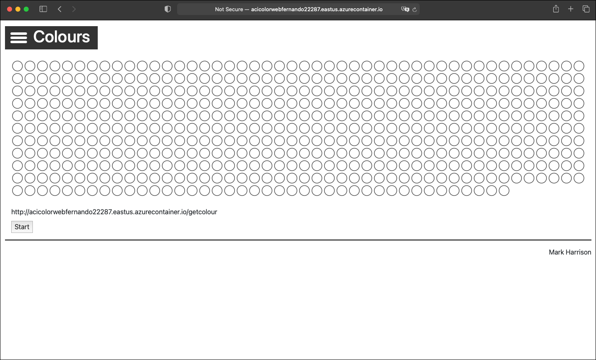
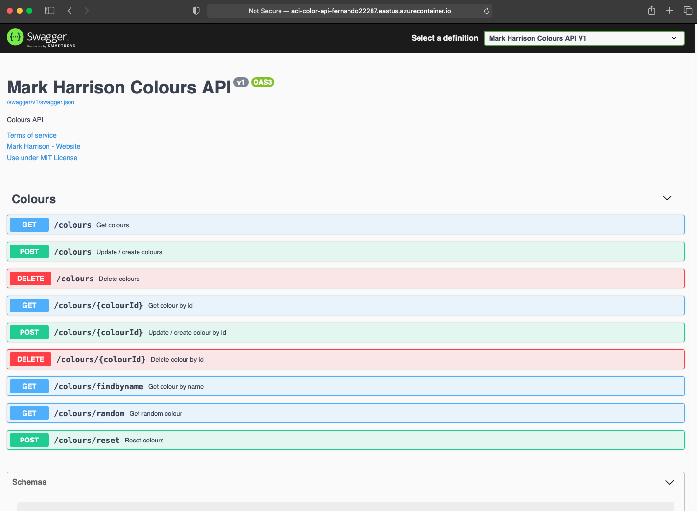

## Task 2: Provision your own instance of ColoursWeb/ColoursAPI

Some of the demos use the ColoursWeb web application and the ColoursAPI API application. In this lab we will show you how to deploy your own instances of the Colours Web and Colours API. Note - ColoursWeb / ColoursAPI is a new version of ColorsWeb/ColorsAPI ... do not mix the web client and API versions.

The code for the ColoursWeb / ColoursAPI applications is available here:

- [ColoursWeb](https://github.com/markharrison/ColoursWeb)
- [ColoursAPI](https://github.com/markharrison/ColoursAPI)

Docker Containers exist for these applications and so provide an easy deployment option.

> IMPORTANT: Due to the new pull restrictions on Docker Hub images, in this lab, we will be using the GitHub registry

- Github (Colours)
  - `docker pull ghcr.io/markharrison/coloursapi:latest`
  - `docker pull ghcr.io/markharrison/coloursweb:latest`
- DockerHub (Colors)
  - `docker pull markharrison/colorweb:latest`
  - `docker pull markharrison/colorapi:latest`

With the container, we can deploy to multiple hosting options: VM's, App Services, ACI, and also AKS. In this lab, we are going to show you how to do it with [Azure Container Instances](https://docs.microsoft.com/en-us/azure/container-instances/).

### Task 2.1: Deploying Web and API containers with Azure Container Instances

1. Login to [Azure Portal](https://portal.azure.com)
2. Open the **Azure Cloud Shell** and choose **Bash Shell** (do not choose PowerShell)

   

3. The first time Cloud Shell is started will require you to create a storage account.

   - Select show advanced settings.
   - Select Resource Group: **apim-rg**
   - Storage account name: apim<inject key="Deployment ID" enableCopy="false" />
   - Fileshare name: apim

   
   
5. We proceed to create a unique identifier suffix for resources created in this Lab:

    
- Define the existing resource group name
```
APIMLAB_RGNAME=myColorsAppRg
```

- Define other variables
```
APIMLAB_UNIQUE_SUFFIX=$USER$RANDOM
APIMLAB_LOCATION=eastus
APIMLAB_COLORS_WEB=mycolorsweb-$APIMLAB_UNIQUE_SUFFIX
APIMLAB_IMAGE_WEB=ghcr.io/markharrison/coloursweb:latest
APIMLAB_DNSLABEL_WEB=acicolorweb$APIMLAB_UNIQUE_SUFFIX
APIMLAB_COLORS_API=mycolorsapi-$APIMLAB_UNIQUE_SUFFIX
APIMLAB_IMAGE_API=ghcr.io/markharrison/coloursapi:latest
APIMLAB_DNSLABEL_API=aci-color-api-$APIMLAB_UNIQUE_SUFFIX
```

- Remove Underscores and Dashes from the unique suffix
```
APIMLAB_UNIQUE_SUFFIX="${APIMLAB_UNIQUE_SUFFIX//_}"
APIMLAB_UNIQUE_SUFFIX="${APIMLAB_UNIQUE_SUFFIX//-}"
```


- Check Unique Suffix Value (Should be No Underscores or Dashes)
```
echo $APIMLAB_UNIQUE_SUFFIX
```

- Persist for Later Sessions in Case of Timeout
```
echo export APIMLAB_UNIQUE_SUFFIX=$APIMLAB_UNIQUE_SUFFIX >> ~/.bashrc
echo export APIMLAB_RGNAME=$APIMLAB_RGNAME >> ~/.bashrc
echo export APIMLAB_LOCATION=$APIMLAB_LOCATION >> ~/.bashrc
echo export APIMLAB_COLORS_WEB=$APIMLAB_COLORS_WEB >> ~/.bashrc
echo export APIMLAB_IMAGE_WEB=$APIMLAB_IMAGE_WEB >> ~/.bashrc
echo export APIMLAB_DNSLABEL_WEB=$APIMLAB_DNSLABEL_WEB >> ~/.bashrc
echo export APIMLAB_COLORS_API=$APIMLAB_COLORS_API >> ~/.bashrc
echo export APIMLAB_IMAGE_API=$APIMLAB_IMAGE_API >> ~/.bashrc
echo export APIMLAB_DNSLABEL_API=$APIMLAB_DNSLABEL_API >> ~/.bashrc
```

- Generate a DNS label that meets the criteria
  ```
   APIMLAB_DNSLABEL_WEB="acicolorweb$(echo "$APIMLAB_UNIQUE_SUFFIX" | tr -cd '[:alnum:]' | cut -c 1-57)"
  ```

- Generate a container name that meets the criteria
  ```
   APIMLAB_COLORS_WEB="mycolorsweb-$(echo "$APIMLAB_UNIQUE_SUFFIX" | tr -cd '[:alnum:]' | cut -c 1-55)"
  ```

6. Create the container instance for the colors web:

```  
az container create --resource-group $APIMLAB_RGNAME --name $APIMLAB_COLORS_WEB --image $APIMLAB_IMAGE_WEB --dns-name-label $APIMLAB_DNSLABEL_WEB --ports 80 --restart-policy OnFailure --no-wait
```


8. Now we run the following command to check the status of the deployment and get the FQDN to access the app:

    ```bash
    # We check the status
    az container show --resource-group $APIMLAB_RGNAME --name $APIMLAB_COLORS_WEB --query "{FQDN:ipAddress.fqdn,ProvisioningState:provisioningState}" --out table
    ```

    The output should something like this:

    ```
    FQDN                                                  ProvisioningState
    ----------------------------------------------------  -------------------
    aci-color-web-fernando22287.eastus.azurecontainer.io  Succeeded
    ```

    Once we have a "Succeeded" message we proceed to navigate to the FQDN. And we should see our home page for our Colours Web:

    


- Generate a DNS label that meets the criteria for color-api

  ```
   APIMLAB_DNSLABEL_API="aci-color-api-$(echo "$APIMLAB_UNIQUE_SUFFIX" | tr -cd '[:alnum:]' | cut -c 1-53)"
  ```

- Create a valid container name for color-api

  ```
   APIMLAB_CONTAINER_NAME="mycolorsapi-$(echo "$APIMLAB_UNIQUE_SUFFIX" | tr -cd '[:alnum:]' | cut -c 1-55)"
  ```


9. Now we proceed to create the ACI for the colors-api GitHub container:

    ```
    az container create --resource-group $APIMLAB_RGNAME --name $APIMLAB_CONTAINER_NAME --image $APIMLAB_IMAGE_API --dns-name-label $APIMLAB_DNSLABEL_API --ports 80 --restart-policy OnFailure --no-wait

    ```

10. Now we run the following command to check the status of the deployment and get the FQDN to access the app:

    ```
    az container show --resource-group $APIMLAB_RGNAME --name $APIMLAB_CONTAINER_NAME --query "provisioningState" --query "{FQDN:ipAddress.fqdn,ProvisioningState:provisioningState}" --out table
    ```

    The output should something like this:

    ```
    FQDN                                                  ProvisioningState
    ----------------------------------------------------  -------------------
    aci-color-api-fernando22287.eastus.azurecontainer.io  Succeeded
    ```

    Once we have a "Succeeded" message we proceed to navigate to the FQDN. And we should see our home page (Swagger UI) for our Colours API:

    
---
### Summary
In this Task, you have deployed Azure Container Instances (ACI) for both the Colours Web and Colours API applications using GitHub container images. Then you accessed the applications via fully qualified domain names (FQDNs) to verify successful deployment and functionality.

- Now, click on Next from the lower right corner to move on to the next page.
