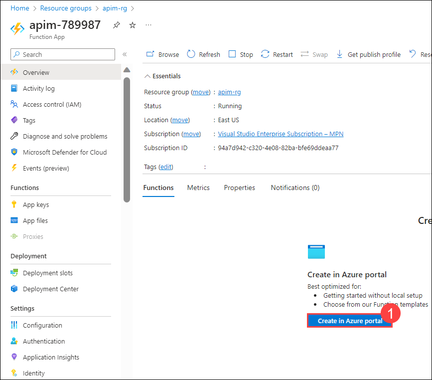
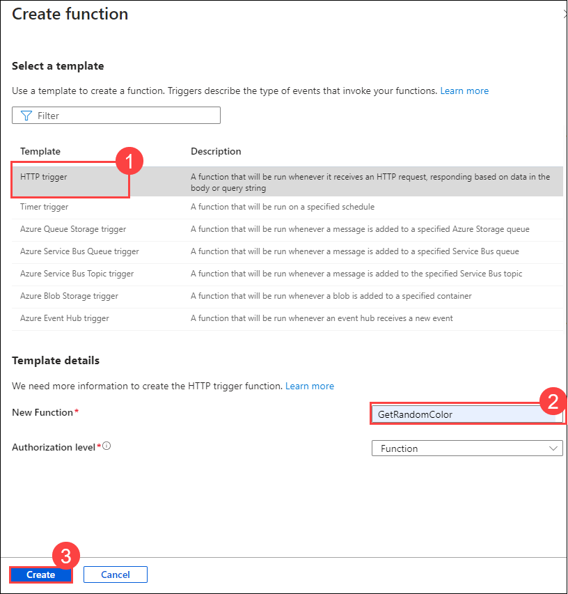
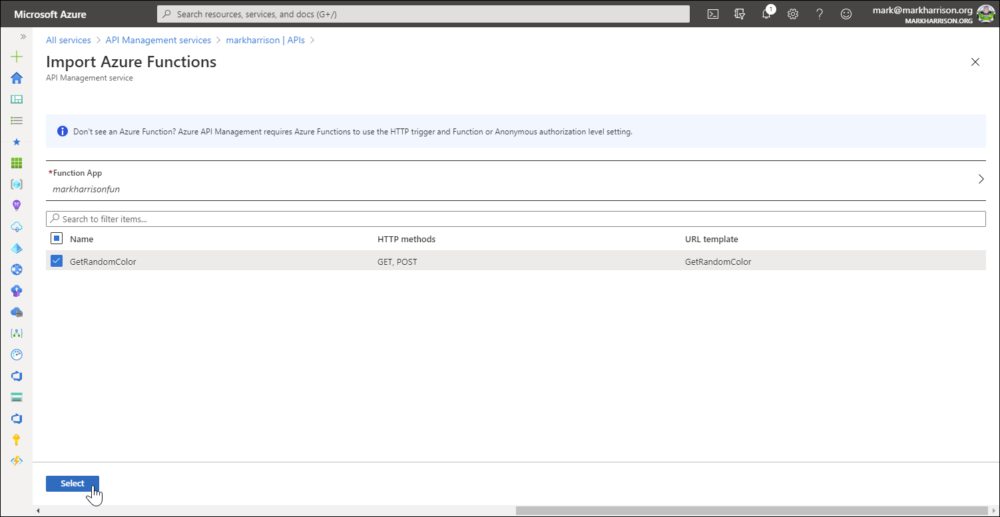
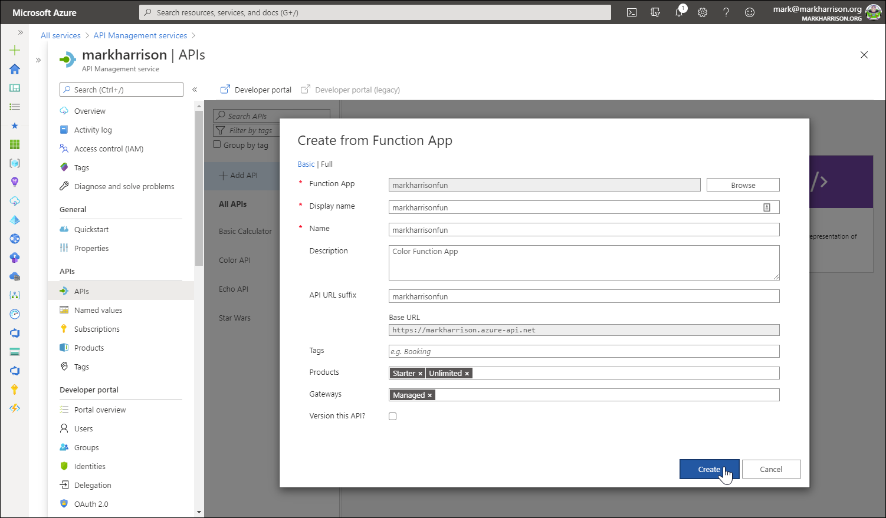
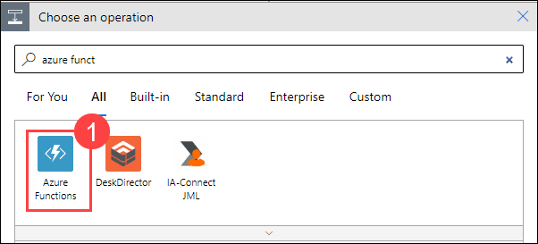
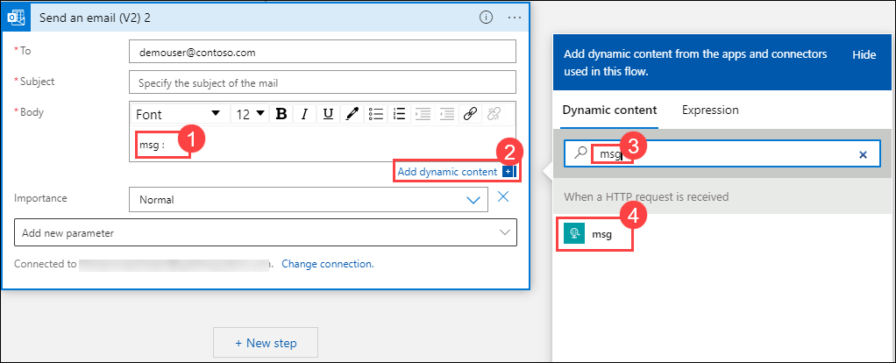
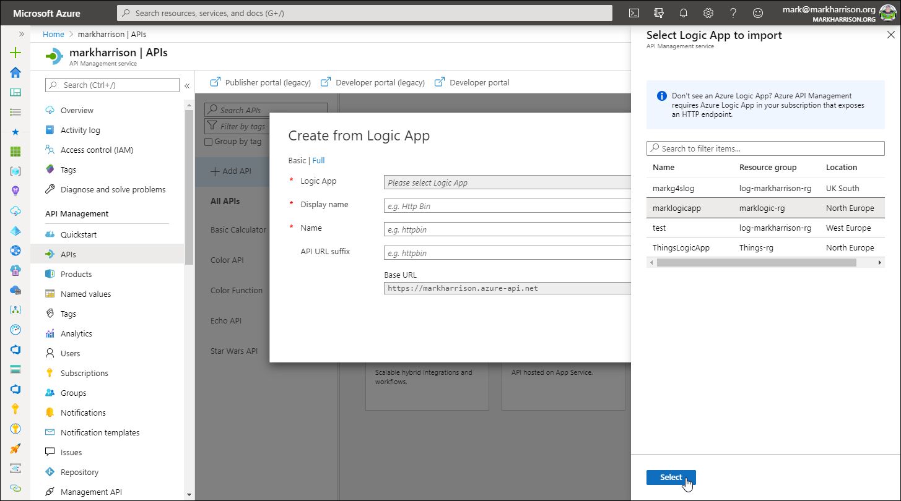

## Task 3: API Proxy to Serverless

Azure Serverless (Functions and Logic Apps) can be configured to benefit from the advantages of Azure API Management.

### Task 3.1: Azure Functions

1. Create a simple function that is Triggered by an HTTP Request

2. Search for Azure Functions in the portal, and select Create.
- Resource group: **apim-rg**
- Function name : **func-<inject key="Deployment ID" enableCopy="false" />**
- Select Runtime stack as .Net and hosting option as **consumption** then click on Create.


3. Once the Resource is created go to Resource, select Create in Azure portal.



4. Select HTTP Trigger and enter the name  of the new function, Select create.



5. Navigate to Code+Test and Replace the code with the following.


```c#
    //string[] strColors = { "blue", "lightblue", "darkblue" };
    string[] strColors = { "green", "lightgreen", "darkgreen" };

    Random r = new Random();
    int rInt = r.Next(strColors.Length);

    return  (ActionResult)new OkObjectResult(strColors[rInt]);
```


Lets add the function to Azure API Management. In the API blade select [+Add API] and the [Function App] tile


- Select the [Browse] button to get a list of Functions in the subscription


- Select the Function App and then the Function




- Amend the Names / Descriptions, URL suffix and select the Products



- As previously add CORS policy

- Validate the function works - either from the Azure management portal or the developer portal


### Task 3.2: Azure Logic Apps

- Create a simple logic app that is Triggered by an HTTP Request

1. Search for Logic App in the portal, and select Create.
- Select Resource Group: **apim-rg**
- Logic App Name: **logicapp-<inject key="Deployment ID" enableCopy="false" />**
- Select plan type as **consumption** and click on create.


2. In the logic app designer select when a HTTP request is received.


- In the Request body JSON Schema insert the following JSON.

```
{
 "type" : "object",
  "properties" : {
      "msg": {
          "type" : "string"
      }
  }


}
```


3. Add a new step, search for Azure Functions, and Select the Azure function that you have created previously.



4. Add a new step to send e-mail, search for Office 365 Outlook, and select send an email (v2). 

- Specify email address to receive e-mail.
- In the body type **Msg** and click on add dynamic content, select msg. type **Color** and Search **body** in dynamic content and select **Azure function.**



5. Add a new step for Response, and save the logic App.


Use the following sample message to generate the schema of the Request body payload.  By specifying the schema, the individual fields (in this case `msg`) can be extracted and referred to in the subsequent logic

```json
{
  "msg": "text"
}
```

Lets add the function to API Managament. In the API blade select [+Add API] and the [Logic App] tile


- Select the [Browse] button to get a list of Logic Apps in the subscription


- Select the Logic App



- Amend the Names / Descriptions, Add URL suffix as **logicapp**,  and select the Products(Starter, Unlimited)


 As previously add CORS policy

- Validate the Logic App works - either from the Azure management portal or the developer poral


- Check the Logic App audit


- Check the email was sent


--- 
### Summary
In this task, you have integrated Azure Functions and Logic Apps with Azure API Management, exposing them as APIs with management capabilities. you have configured, tested, and audited these serverless resources within API Management for seamless integration with other services.
- Now, click on Next from the lower right corner to move on to the next page.
