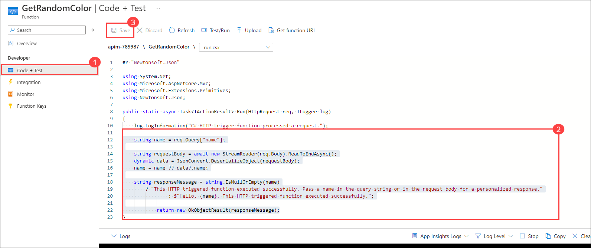
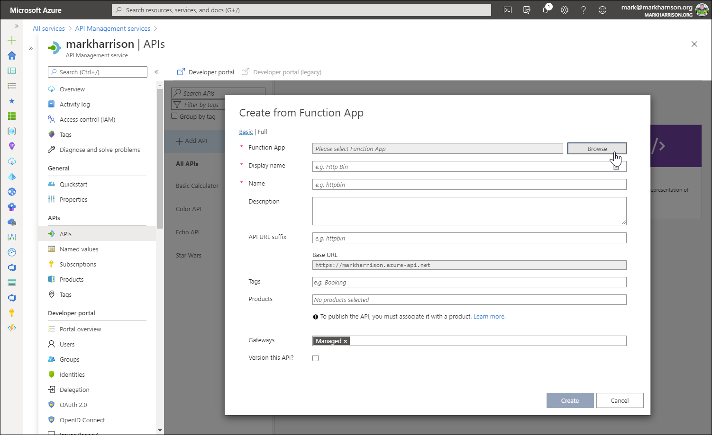
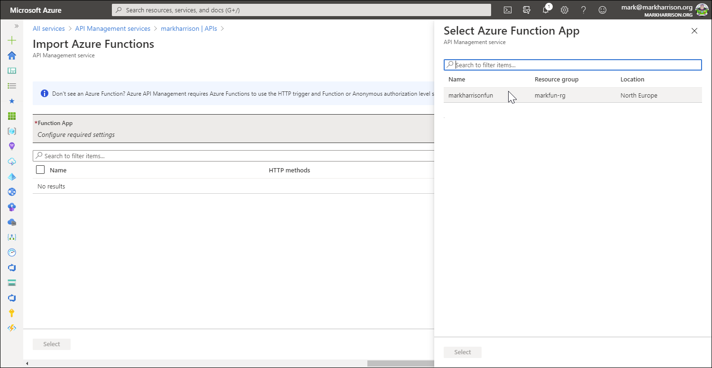
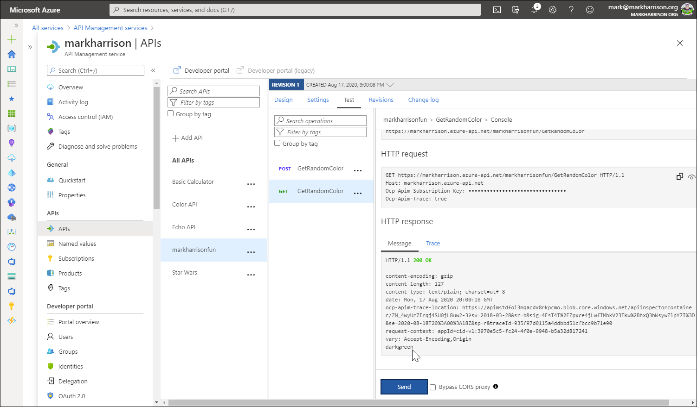
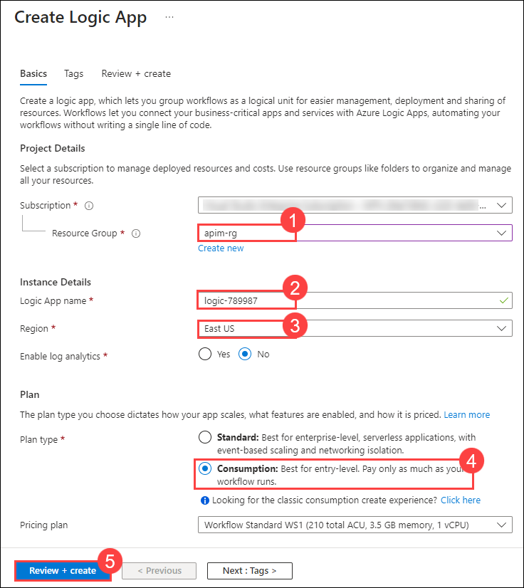
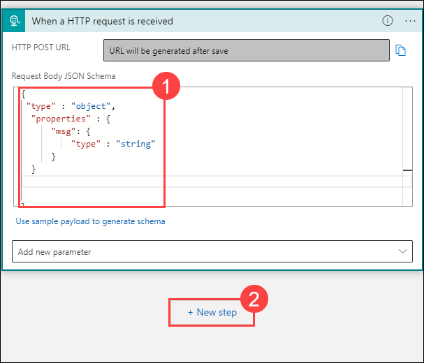
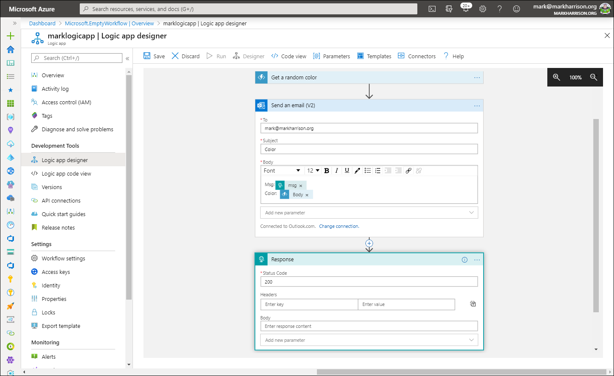
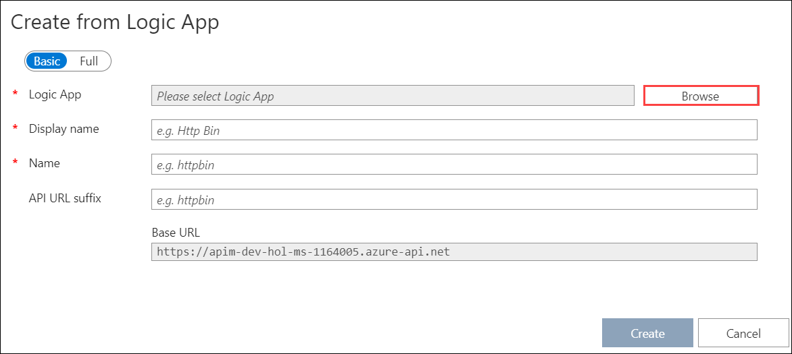

## Task 3: API Proxy to Serverless

Azure Serverless (Functions and Logic Apps) can be configured to benefit from the advantages of Azure API Management.

### Task 3.1: Azure Functions

1. Create a simple function that is Triggered by an **HTTP Request**.

2. Search for **Azure Function** App in the portal, and select **Create**.
   
   

3. Enter the following details:
   
   - Resource group: **apim-rg**
   - Function name : **func-<inject key="Deployment ID" enableCopy="false" />**
   - Do you want to deploy code or container image? : Select **Code**
   - Runtime stack : Select **.Net**
   - Version : 6(LTS)
   - Region: Select the region you used for previous exercises.
   - Operating System : Windows
   - Hosting option and plans : **Consumption (Serverless)**
   - Then click on **Review + Create**.

      

4. On the **Review + Create** tab, click on **Create**.

5. Once the Resource is created click on **Go to Resource**, and select Create in Azure portal.

   

6. Select **HTTP Trigger** **(1)** and enter the New Function as **GetRandomColor** **(2)**, and click on the **Create** **(3)**.

   

7. Navigate to **Code + Test**, Replace the code with the following, and click on **Save**.

   ```c#
   //string[] strColors = { "blue", "lightblue", "darkblue" };
   string[] strColors = { "green", "lightgreen", "darkgreen" };

   Random r = new Random();
   int rInt = r.Next(strColors.Length);

   return  (ActionResult)new OkObjectResult(strColors[rInt]);
   ```

      


8. Lets add the function to Azure API Management. Navigate back to the **API Management service**, in the API blade select [+ Add API] and the [Function App] tile

   

   - Click on the **Browse** button to get a list of Functions in the subscription

      

   - Select the Function App and then the Function

      

      

   - Amend the Names / Descriptions, URL suffix, and select the Products

      

   - As previously added CORS policy

   - Validate the function works - either from the Azure management portal or the developer portal

      

      

### Task 3.2: Azure Logic Apps

- Create a simple logic app that is Triggered by an HTTP Request

1. Search for **Logic App** in the portal, and click on **Add**.

   
  
1. Enter the following details:

   - Select Resource Group: **apim-rg**
   - Logic App Name: **logicapp-<inject key="Deployment ID" enableCopy="false" />**
   - Region : Select the regions you have used for previous exercises. 
   - Plan type : **Consumption**
   - Click on **Review + create**.

      

1. On the **Review + Create** tab, click on **Create**.

1. Once the Resource is created click on **Go to Resource**, from the left menu under Development Tools select **Logic app designer**.

1. In the logic app designer selects **when a HTTP request is received**.

   

   - In the Request body JSON Schema **insert the following JSON (1)**, and select **+ New step (2)**.

      ```
      {
      "type" : "object",
      "properties" : {
            "msg": {
               "type" : "string"
            }
      }

      }
      ```

      

1. Search for **Azure Functions**, and select the **Azure function** that you have created previously.

   

1. Add a new step to send e-mail, search for **Office 365 Outlook**, and select **send an email (v2)**. 

   - **To**: Specify your Email address, i.e. **<inject key="AzureAdUserEmail"></inject>** to receive the e-mail.
   - **Subject**: **Color**
   - **Body**: type **msg**, **:** and click on add dynamic content, select **msg**, type **Color**, **:** and click on add dynamic content, search **body** and select **body** which present in **Azure function**.

      

5. Select **+ New step**, search and select **Response**, now **save** the logic App.

   

   - Use the following sample message to generate the schema of the Request body payload.  By specifying the schema, the individual fields (in this case `msg`) can be extracted and referred to in the subsequent logic

      ```json
      {
      "msg": "text"
      }
      ```

6. Lets add the function to API Management. In the API blade select **+ Add API (1)** and the **Logic App (2)** tile

   

   - Select the **Browse** button to get a list of **Logic Apps** in the subscription

      

   - Select the **Logic App**, and choose **Select**.

      

   - On the **Create from Logic App**, select **Full**. Amend the Names / Descriptions, Add URL suffix as **logicapp**, select the Products(Starter, Unlimited), and select **Create**.

      

    - As previously add CORS policy

   - Validate the Logic App works - either from the Azure management portal or the developer portal.

      

      

   - Check the Logic App audit

      

   - Check the email was sent

      

--- 
### Summary
In this task, you have integrated Azure Functions and Logic Apps with Azure API Management, exposing them as APIs with management capabilities. you have configured, tested, and audited these serverless resources within API Management for seamless integration with other services.
- Now, click on Next from the lower right corner to move on to the next page.
