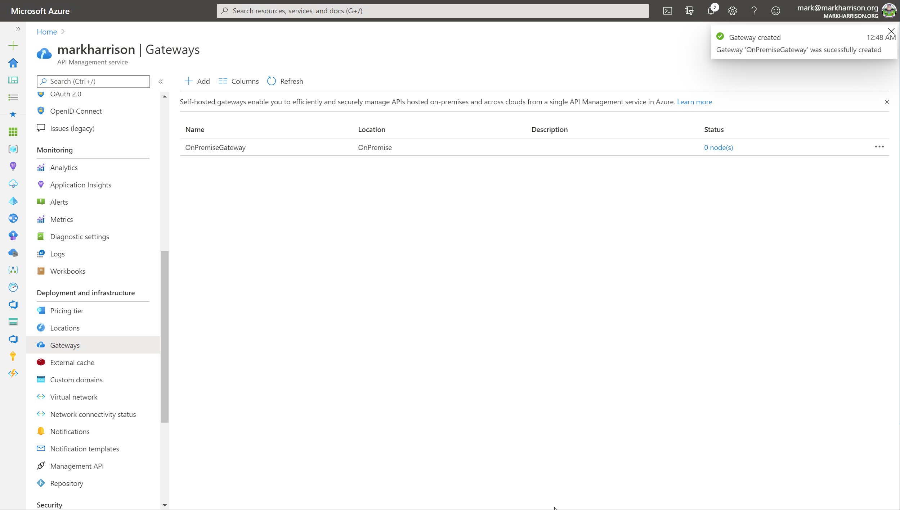
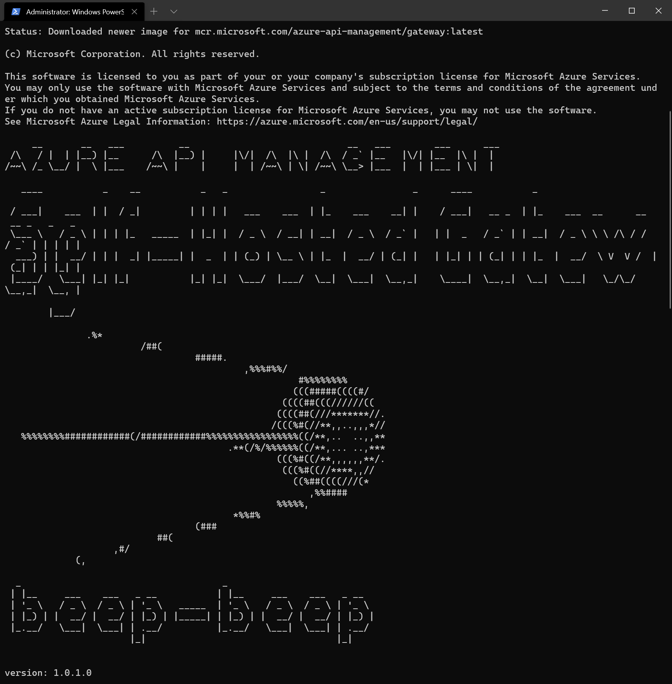
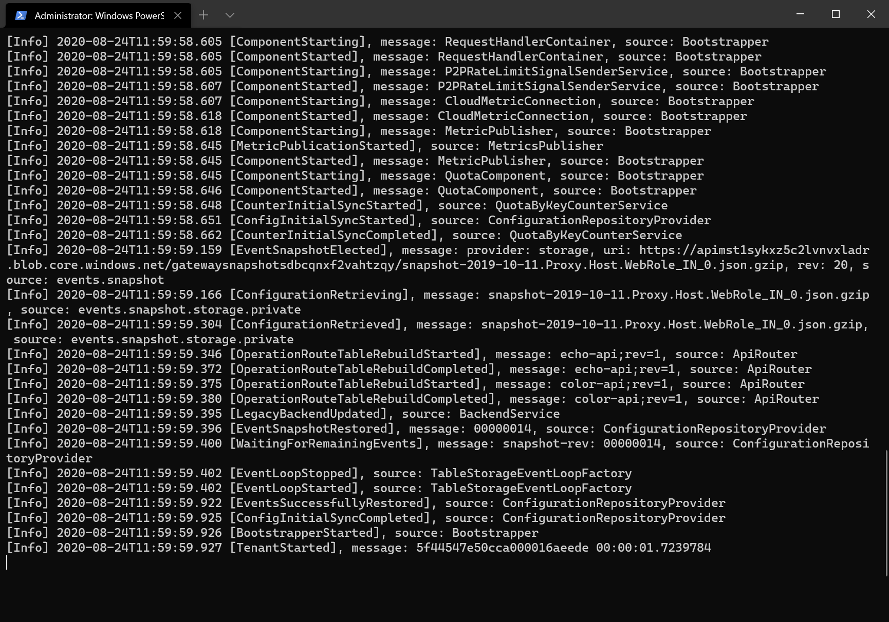

## Task 4: Self-hosted Gateway

With the Azure API Management self-hosted gateway, organizations have the ability to deploy an instance of the Azure API Management gateway component to the environments where they host their applications and/or APIs - for example, in an on-premise data center.

The self-hosted gateways are hosted in a Docker or Kubernetes environment and are managed from the Azure API Management service they are connected to.

This part of the lab requires that the user has Docker Desktop installed. we have already pre-installed Docker Desktop in the Jump VM.

There are two terms to become familiar with:

- Gateway Deployment ... This is a set of Azure API Management configuration details that will be used by the Gateway Node(s)
- Gateway Node ... This is a running instance of an Azure API Management gateway proxy i.e. a containerized instance of the gateway

There can be multiple Gateway Deployments and multiple Gateway Nodes.  The Gateway Deployments are chargeable - the Gateway Nodes are free i.e. an organization pays for the management control plane, but the compute is free (you are running on the organization's own hardware)


## Task 4.1: Deploy the Self-hosted Gateway

To deploy a self-hosted gateway:

- Select the `Gateways` option from the menu
- Select `+ Add`


- Enter a Name and Location for the Gateway
- Select the required APIs from those that are configured in the Azure API Management instance
  - Our lab will use the Colors API - this was configured in an earlier module
- Select the `Add` button


The added gateway will appear in the list ... this is the Gateway Deployment.




- Click on the gateway in the list - a blade appears allowing further configuration


- Select the `Deployment` option from the menu
  - There are scripts for deploying on Docker and Kubernetes ... for this lab, we will be using the Docker option
- Download the **env.config** file by clicking on it, and it will be saved automatically in the following directory: C:/Users/demouser/Downloads.
- Copy the Docker run command but remove the *-d* parameter ... this is so the logs are displayed to the terminal

```text
docker run -p 80:8080 -p 443:8081 --name OnPremiseGateway --env-file env.conf mcr.microsoft.com/azure-api-management/gateway:latest
```


From a command line - elevated to Administrator (needed for Docker commands)

- You can launch Docker Desktop by using the shortcut available on the Jump VM. After launching Docker Desktop, accept the terms, click "Continue without sign in", and skip the survey. Docker Engine may take about 2-3 minutes to start. Minimize Docker Desktop and then open the Command Prompt.
- Navigate to the location where the *env.conf* is located, Run command `cd C:/Users/demouser/Downloads`
- Run the Docker run command
  ```
   docker run -p 80:8080 -p 443:8081 --name OnPremiseGateway --env-file env.conf mcr.microsoft.com/azure-api-management/gateway:v2
  ```
  


The first time this is executed, it will need to pull down the Docker image - and so there will be a small delay.  Subsequently - if restarted - it will just use the downloaded image.


Once downloaded, the log output from the container will display a Sputnik logo (this was an internal code name) and some diagnostic logs.






Note that in the Gateway blade, we can see the status - it will show there is one healthy Gateway Node connected to the Deployment.   The Gateway Node will keep in sync, and be automatically updated should any of the Gateway Deployment config changes.


## Task 4.2: Testing the API

Our Gateway Node is now deployed - and we can test that it works.

- Open the Developer portal, go to the Profile page, and get the API key for Unlimited products
- Open Notepad - Make note of URLs including the key.  For our lab test, the machine name is just *localhost*
  - https://localhost/colors/random?key=Unlimited-Key


- Use Postman to test the API, you can find the postman shortcut on the desktop... should see the random color appear in the response and this confirms everything is working properly
- If tested with a browser, then a warning needs to be accepted to proceed - this is because trusted TLS certificates have not been set up Diagnostics 
 for the API call will be logged by the container.


---
### Summary
In this task, you have deployed a self-hosted gateway for Azure API Management, enabling the hosting of API gateway nodes in Docker or Kubernetes environments. Then you have configured the gateway deployment, downloaded configuration files, and executed Docker commands to start the gateway node. Finally, tested the API using Postman, confirming the proper functionality of the self-hosted gateway.
