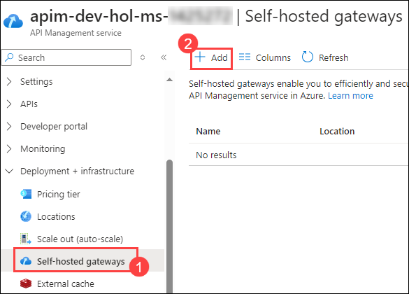
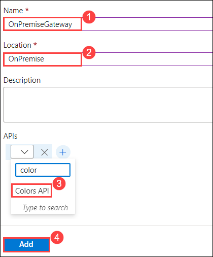
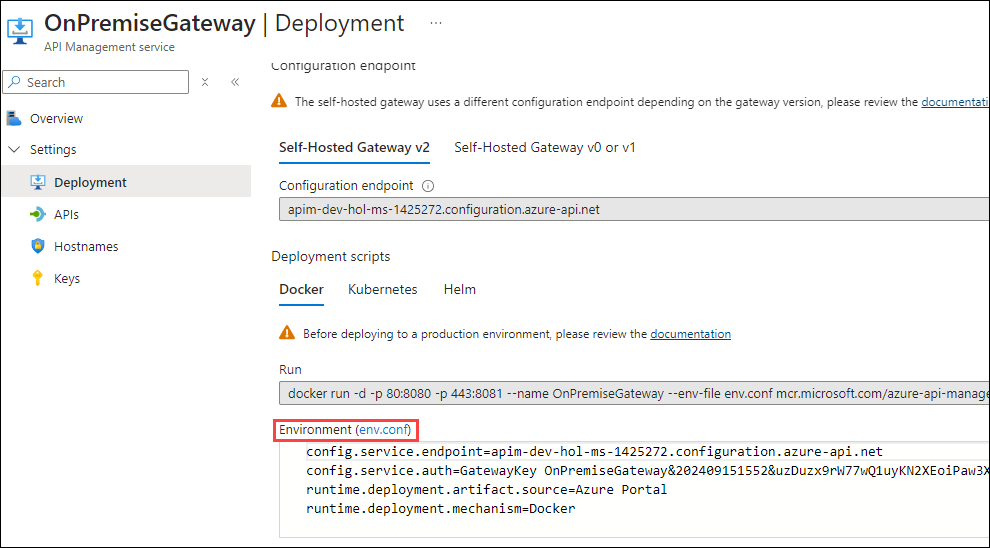
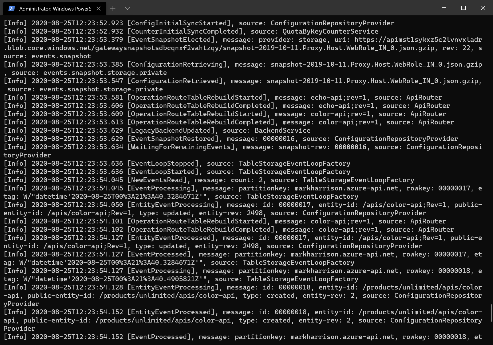

## Task 4: Self-hosted Gateway

With the Azure API Management self-hosted gateway, organizations have the ability to deploy an instance of the Azure API Management gateway component to the environments where they host their applications and/or APIs - for example, in an on-premise data center.

The self-hosted gateways are hosted in a Docker or Kubernetes environment and are managed from the Azure API Management service they are connected to.

This part of the lab requires that the user has Docker Desktop installed. we have already pre-installed Docker Desktop in the Jump VM.

There are two terms to become familiar with:

- Gateway Deployment ... This is a set of Azure API Management configuration details that will be used by the Gateway Node(s)
- Gateway Node ... This is a running instance of an Azure API Management gateway proxy i.e. a containerized instance of the gateway

There can be multiple Gateway Deployments and multiple Gateway Nodes.  The Gateway Deployments are chargeable - the Gateway Nodes are free i.e. an organization pays for the management control plane, but the compute is free (you are running on the organization's own hardware)


## Task 4.1: Deploy the Self-hosted Gateway

To deploy a self-hosted gateway:

- In the **API Management service**, select the **Self-hosted Gateways** **(1)** option from the menu under **Deployment + infrastructure**, and click **+ Add** **(2)**

    

- Enter the following details:

  - Name - **OnPremiseGateway** **(1)**
  - Location - **OnPremise** **(2)**
  - Select the required APIs from those that are configured in the Azure API Management instance
    - Our lab will use the **Colors API** **(3)** - this was configured in an earlier module
  - Click on **Add** **(4)** button

    

- The added Gateway will appear in the list.

  

- Select the **OnPremiseGateway** gateway from the list, and a blade will appear allowing for further configuration.

- Under Settings, select the **Deployment** option.

  - You can find the scripts for deploying on Docker and Kubernetes, for this lab, we will be using the Docker option.

- Download the **env.conf** file by clicking on it as shown in the below image, and it will be saved automatically in the following path: `C:/Users/demouser/Downloads`.

    

- Copy the Docker run command under Deployment scripts, but remove the *-d* parameter. This is the logs are displayed to the terminal.

  ```text
  docker run -d -p 80:8080 -p 443:8081 --name OnPremiseGateway --env-file env.conf mcr.microsoft.com/azure-api-management/gateway:v2
  ```

    

- In the LabVM search for Windows Powershell and run as Administrator (needed for Docker commands).

  - You can launch Docker Desktop by using the shortcut available on the Jump VM. After launching Docker Desktop, **accept the terms**, click **Continue without signing in**, and **skip** the survey. Docker Engine may take about 2-3 minutes to start. Minimize Docker Desktop and then open the PowerShell.

  - Navigate to the location where the *env.conf* is located, Run command :
    Make sure to replace the demouser with the username.
    ```
    cd C:/Users/demouser/Downloads
    ```
    ```
    cat env.conf
    ```
  - Run the Docker run command
    ```
    docker run -p 80:8080 -p 443:8081 --name OnPremiseGateway --env-file env.conf mcr.microsoft.com/azure-api-management/gateway:v2
    ```

      

- The first time this is executed, it will need to pull down the Docker image. So there will be a small delay.  Subsequently - if restarted - it will just use the downloaded image.

  

- Once downloaded, the log output from the container will display a Sputnik logo (this was an internal code name) and some diagnostic logs.

  


  

  >**Note** that in the Gateway blade, we can see the status - it will show there is one healthy Gateway Node connected to the Deployment.   The Gateway Node will keep in sync, and be automatically updated should any of the Gateway Deployment config changes.

  

## Task 4.2: Testing the API

Our Gateway Node is now deployed, we can test it.

- Open the **Developer portal**, go to the **Profile** page, and get the **Primary key** for Unlimited products
- Open Notepad - Make note of URLs including the key.  For our lab test, the machine name is just *localhost*, replace **Unlimited-Key** with the primary key that you copied.
  
  - https://localhost/colors/random?key=Unlimited-Key

    

- Use Postman to test the API, you can find the **Postman** shortcut on the desktop, create an account with the **Username: <inject key="AzureAdUserEmail"></inject>** and **Password: <inject key="AzureAdUserPassword"></inject>**, log in to the postman.

- If tested with a browser, then a warning needs to be accepted to proceed - this is because trusted TLS certificates have not been set up Diagnostics 
 for the API call will be logged by the container.

- Inside the **Postman**, make sure that you are on the **Home** page, select **Workspaces** drpo-down, and select **My Workspace**. On the **My Workspace** page, select **New** and select **HTTP**. Now, in the **Enter URL or paste text**, enter the URL, and select **Send**.

  


  


---
### Summary
In this task, you have deployed a self-hosted gateway for Azure API Management, enabling the hosting of API gateway nodes in Docker or Kubernetes environments. Then you have configured the gateway deployment, downloaded configuration files, and executed Docker commands to start the gateway node. Finally, tested the API using Postman, confirming the proper functionality of the self-hosted gateway.
