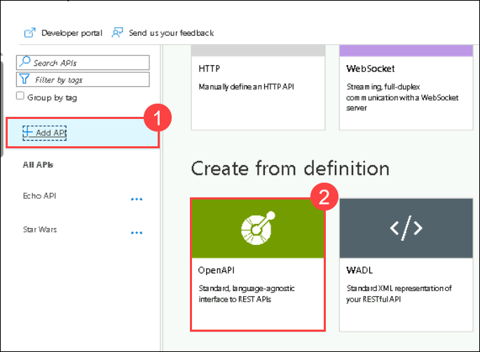
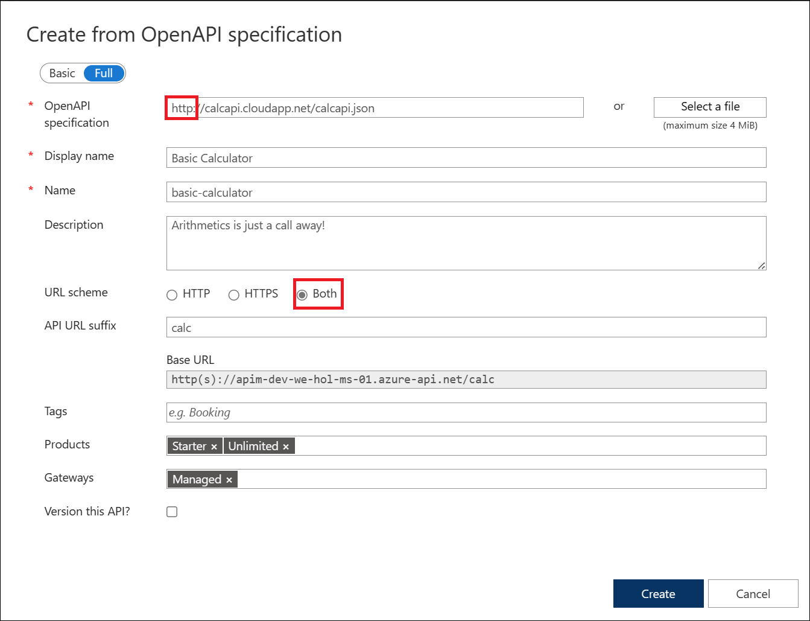
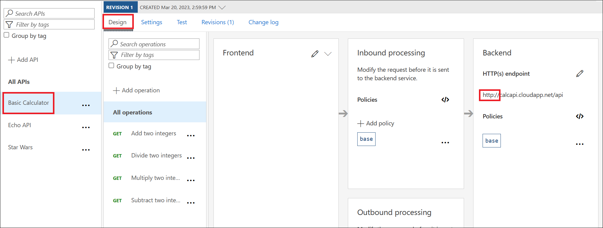
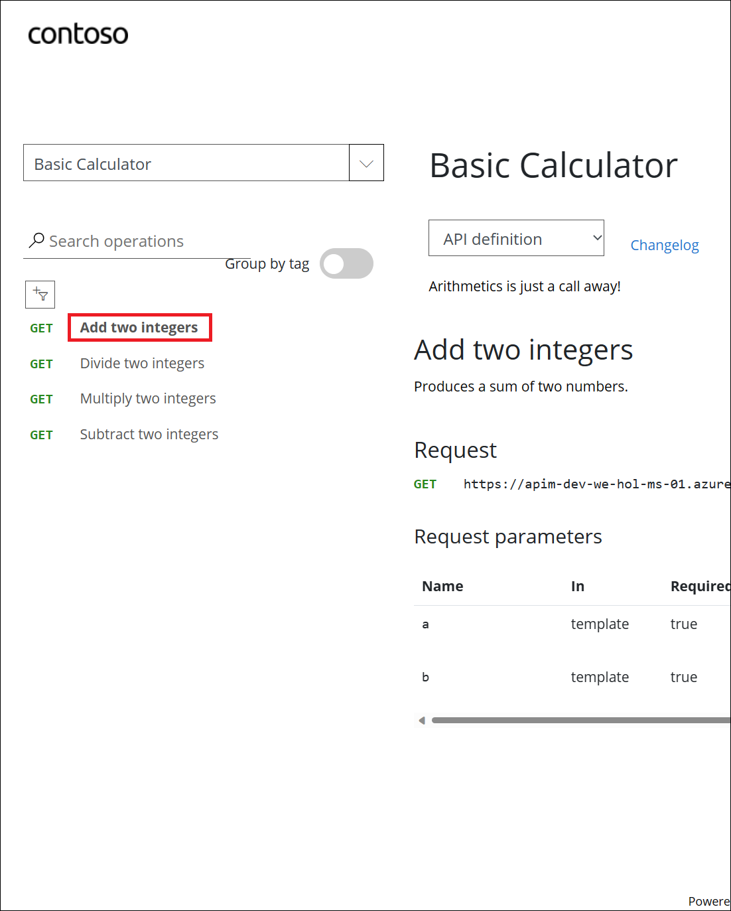
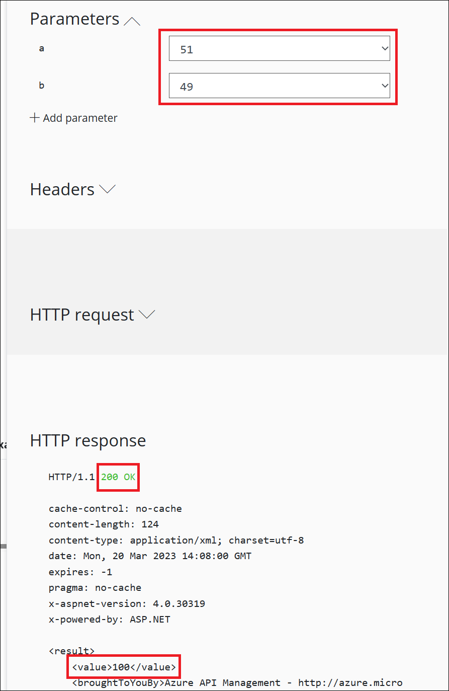
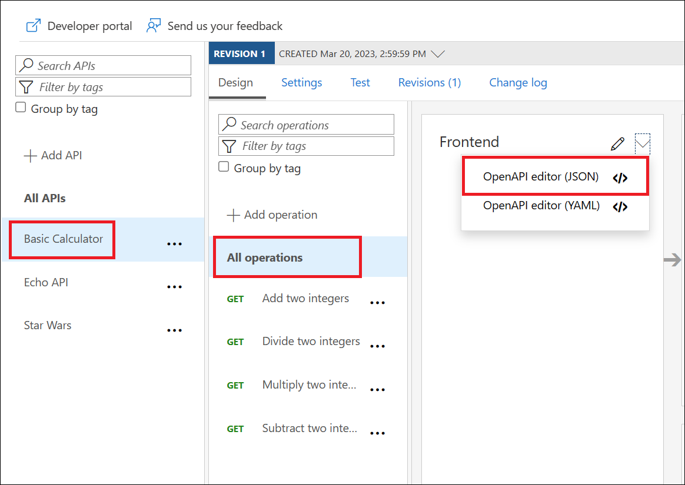
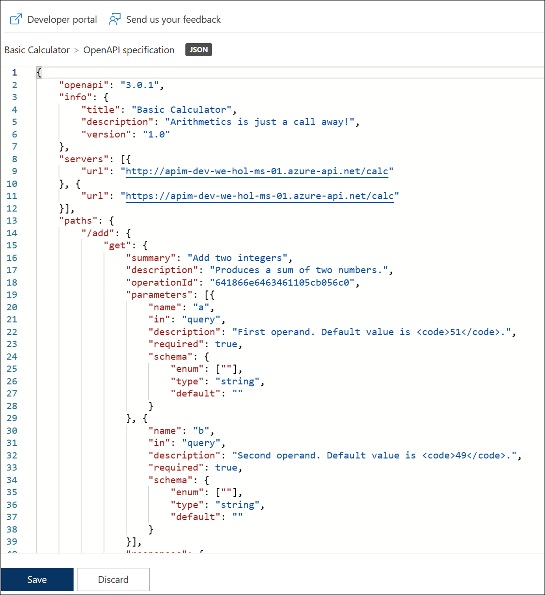

## Task 3: Import API using OpenAPI

Instead of importing operations one-by-one, you can also import a full API. The [OpenAPI specification](https://www.openapis.org/) (aka [Swagger](https://swagger.io)) is a definition format to describe RESTful APIs. The specification creates a RESTful interface for easily developing and consuming an API by effectively mapping all the resources and operations associated with it.

As a demo, we will use an API that offers a simple calculator service : [Calc API](http://calcapi.cloudapp.net)

> This is an older API and is only available via `HTTP`. Azure API Management provides a means for fronting access to it via `HTTPS`, which further demonstrates how Azure API Management can help with a secure, uniform facade while the backend implementation can be reworked and upgraded.

- Navigate back to your Azure API Management instance.
1) On the left menu, open the **APIs** blade.  
2) Click on **Add API**.  
3) Under **Create from definition** select **OpenAPI**.

   
5) Select the **Full** option in the **Create from OpenAPI specification** dialog.  
6) Enter `http://calcapi.cloudapp.net/calcapi.json` as the **OpenAPI specification** value. You should subsequently see **Display name**, **Name**, and **Description** populate.  

> **Note the intentional use of `http` instead of `https` as this backend does not presently support `https`.**  

6) While the backend service only runs on `HTTP`, we need to **set URL scheme to `Both`** to allow for Azure API Management ingress to occur on HTTPS for callers such as the Developer Portal.  
7) Set the **API URL suffix** to `calc`.  
8) Assign **Starter** and **Unlimited** products.  
9) Press **Create**.  

- Once the API is created, it will show in the list of APIs along with all of its operations.

> Ensure that the backend shows as `HTTP`. If that is not the case, navigate to the **Settings** tab and update the **Web service URL** accordingly.

  

- Back in the Developer Portal, try out the Calculator API via the **Add two integers** GET method, then examine the response.  

> Accepting the defaults of `49` and `51` suffices. There's presently an issue where defaults are shown in a dropdown. If you wanted to change the values, add new `a` and `b` parameters and values, then remove the dropdown values.

- Back in the Azure API Management Portal, we can inspect / edit the Open API definition by selecting the *Edit* icon from the Frontend block:

---

## Troubleshooting

### Unable to complete the request

This is likely a mixed-content CORS error in which you are attempting a call to an Azure API Management endpoint that is only set up for *HTTP*. It fails as the Developer Portal runs on *HTTPS*. Please check the setup steps above for the _URL scheme_.

---
### Summary
In this task, you imported the "Calc API" using the OpenAPI specification in Azure API Management, allowing HTTPS access to an HTTP-only backend service. You configured the API, tested it in the Developer Portal, and explored its OpenAPI definition.
Then, you added and configured the "Products" feature in Azure API Management, creating a "Gold Tier" product and managing access control for developers and guests, thereby allowing users to subscribe and access the associated APIs and products in the Developer Portal.
- Now, click on Next from the lower right corner to move on to the next page.
