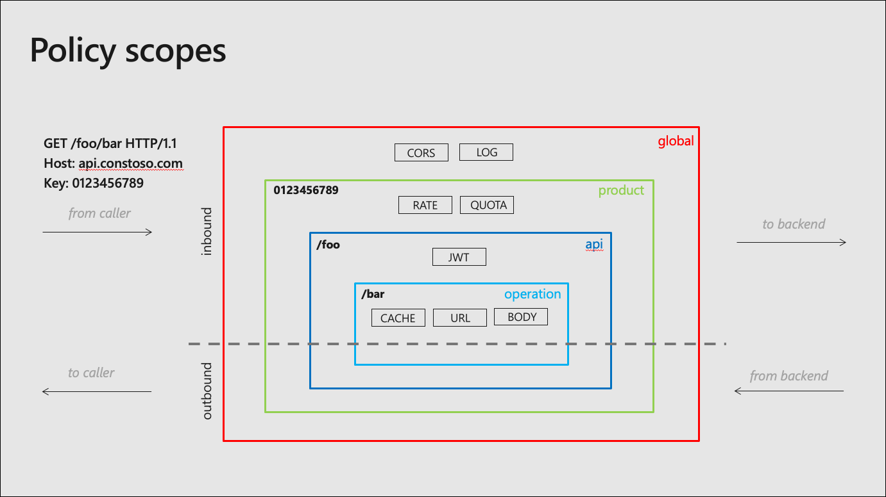
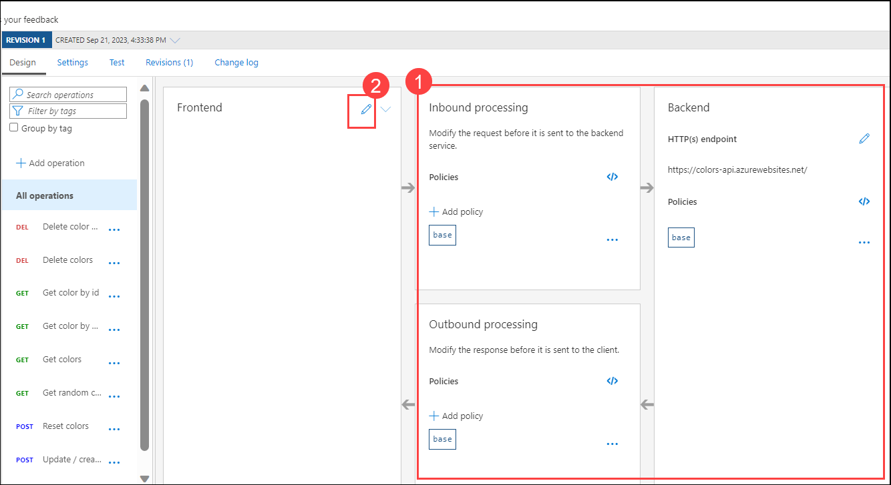
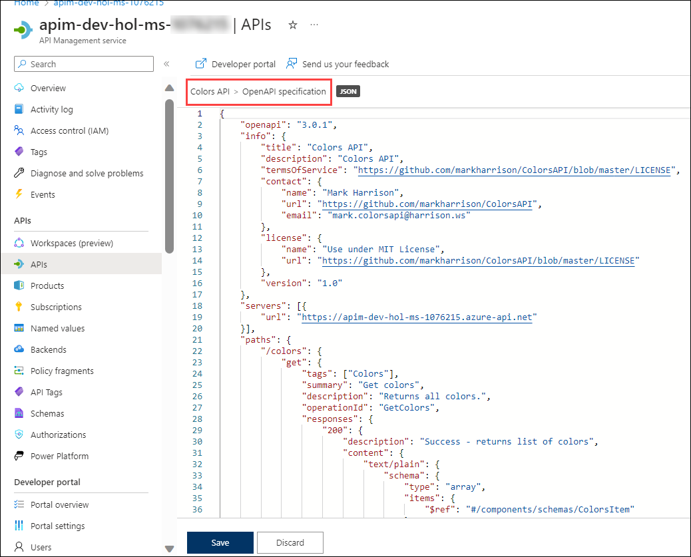
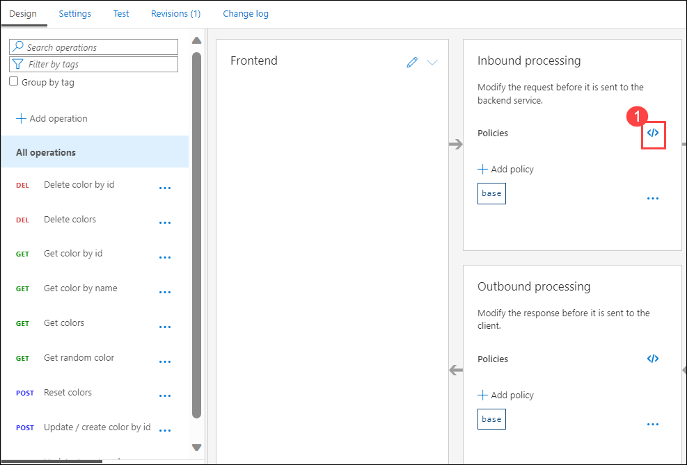
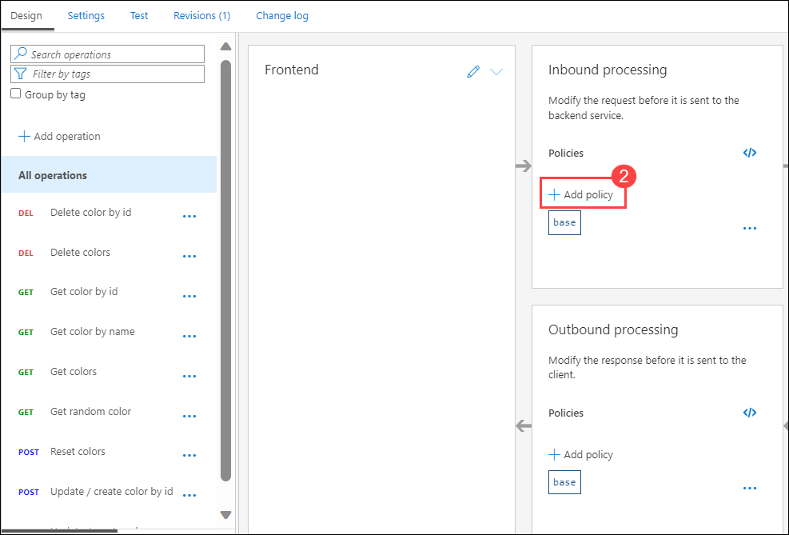
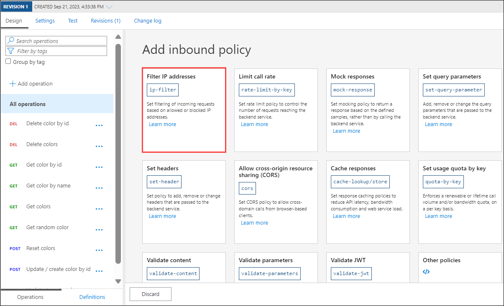

## Exercise 4: Policy Expressions

## Estimated Duration: 90 minutes

Policy Expressions are used to control traffic to and modify the behavior of the Backend API. At the time of this writing, [APIM Policy Expressions support C# 7](https://docs.microsoft.com/en-us/azure/api-management/api-management-policy-expressions). Please note that a specific subset of .NET Framework types, not the entire Framework, are made available. This is to cover the most frequently-needed types and operations without introducing bloat into APIM.  

Using C# statements and an ability to access the API context, as well as your Azure API Management service configuration, Policy Expressions are a powerful way to modify the behavior of the API at runtime.

Don't hesitate to read the [APIM policies documentation](https://docs.microsoft.com/en-us/azure/api-management/api-management-policies).

We had a brief look earlier at setting CORS policies. Lets dive in a bit deeper:

Policies can be applied at multiple scopes and follow this hierarchy. It is important to understand at what level to apply policy to appropriately yield security, robustness, and flexibility.

### Azure API Management Portal oddities

> The Azure API Management Portal is good, but it's not perfect.  

There are two things to pay particular attention to:

- When switching away from the **Test** tab, all values and settings you made for the previous test will be reset. You will need to set every test up from scratch, unfortunately.

- When switching to the **Design** tab to make API operation changes, note that **All operations** is always selected regardless of whether you were testing a specific operation prior. This can cause confusion when adding policies in our labs to specific operations as they can erroneously be added to **All operations**.

### Getting Started - Frontend/Inbound/Outbound/Backend

Select an API (e.g. **Colors**). Policy can be configured for **Inbound processing**, **Backend**, and **Outbound processing**. Most commonly, policies are applied in the **Inbound processing** section. Select the pencil icon to visually edit any section or the `</>` code brackets to edit the underlying XML. The configuration can be scoped to the API (All operations) or to an individual operation.

The **Frontend** section allows for editing of the OpenAPI / Swagger definition.

Editing the Frontend:
  - If editing an operation, there is a choice of the **Code View** or **Forms-based** editor.
  - If editing an API, the only option is the **Code View** editor.
  - The **Code View** editor allows amendments to the OpenAPI / Swagger definition.

    

    

Editing **Inbound processing / Outbound processing / Backend**:

- Using the **Code Editor**:

  

- Using the **Form Editor**:

  

  

### Now, click on Next from the lower right corner to move on to the next page.
