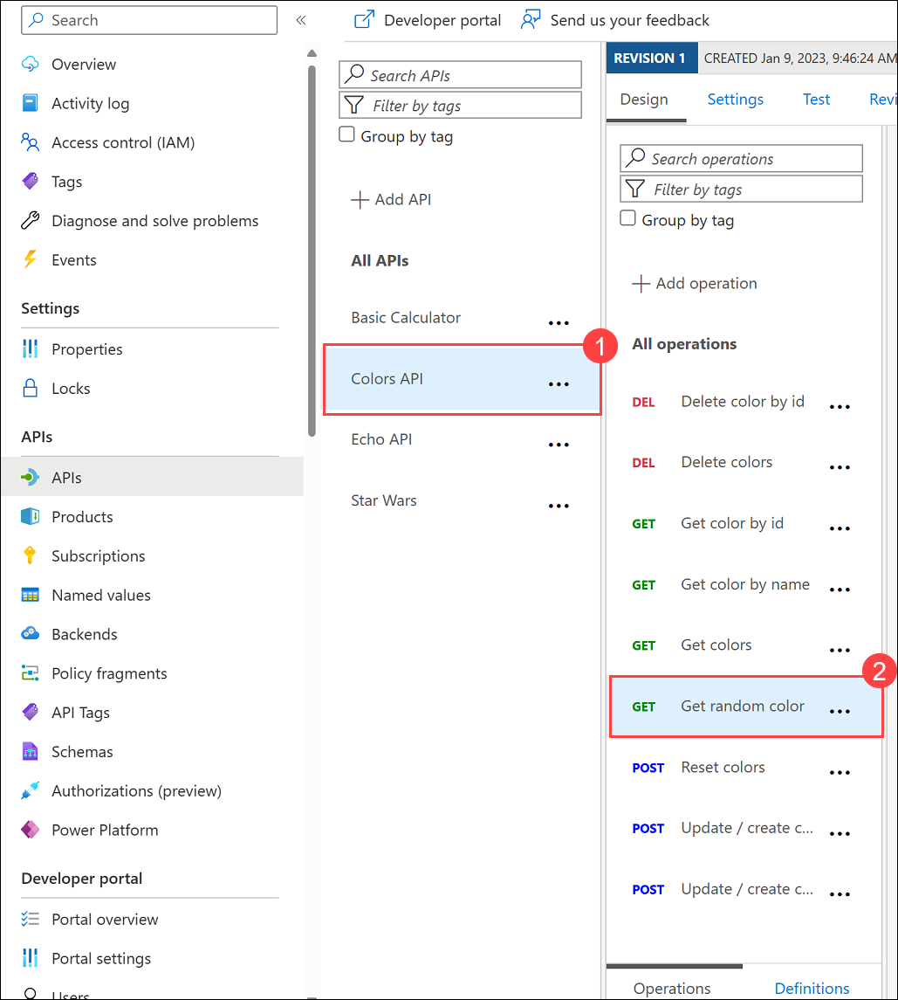
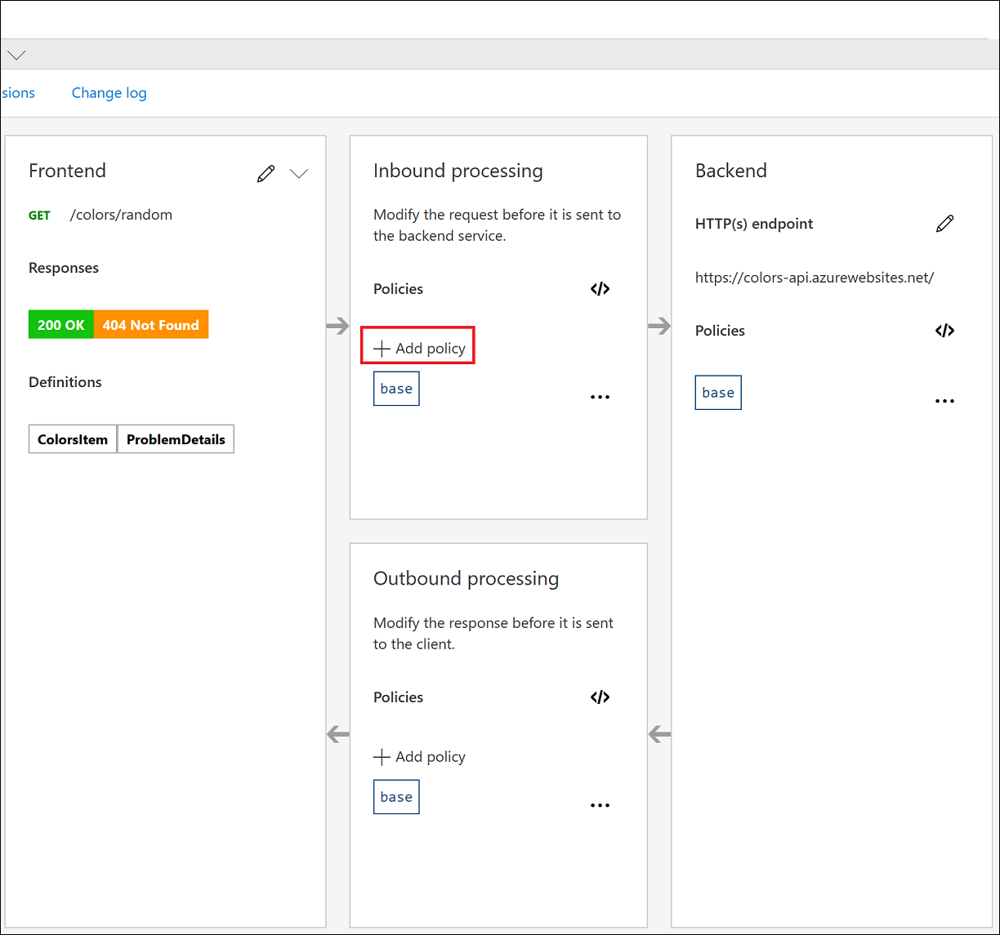
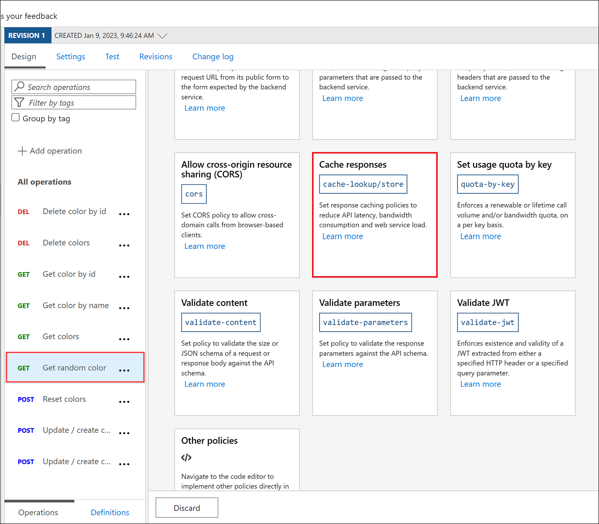
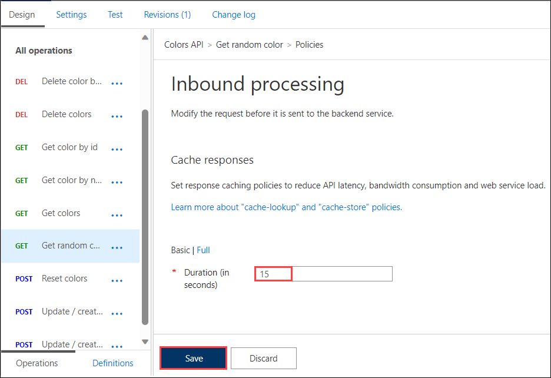

## Continuation for Exercise-4, Task 2: Caching policy

Azure API Management can be configured for response caching which can significantly reduce API latency, bandwidth consumption, and web service load for data that does not change frequently.

1. Using the Azure Management portal, navigate to the **Colors API (1)** and set a caching policy for the **Get random color (2)** call:

      

1. Click on **Add policy**.
    
      

1. Select **Cache responses**.

      

1. Set a caching duration of `15` seconds and **Save**.
    > Simple caching configuration is not yet implemented in the Azure Management portal. We shall see later how it can be done using policy expressions.

      

1. Navigate back to the website and configure the Colors website from Exercise 3(Task 4.2) to use the Unlimited subscription URL.
1. Select **Start**.
1. Notice that for each 15-second period, the same color is set.

    > **Note:** If you are unable to see colors, please refresh the page once. 

    

1. Looking at the **Get Random color** GET API policies in the **Code View**, you'll see the caching policy defined:
    ```xml
    <policies>
        <inbound>
            <base />
            <cache-lookup vary-by-developer="false" vary-by-developer-groups="false" allow-private-response-caching="false" must-revalidate="false" downstream-caching-type="none" />
        </inbound>
        <backend>
            <base />
        </backend>
        <outbound>
            <base />
            <cache-store duration="15" />
        </outbound>
        <on-error>
            <base />
        </on-error>
    </policies>
    ```

> **Congratulations** on completing the task! Now, it's time to validate it.
<validation step="23e3a74f-bdaf-49f0-9cab-d1090fe06328" />

## Summary
In this task, you configured response caching for the "Get random color" call in the Colors API using Azure API Management.

### Now, click on Next from the lower right corner to move on to the next page for further tasks.
