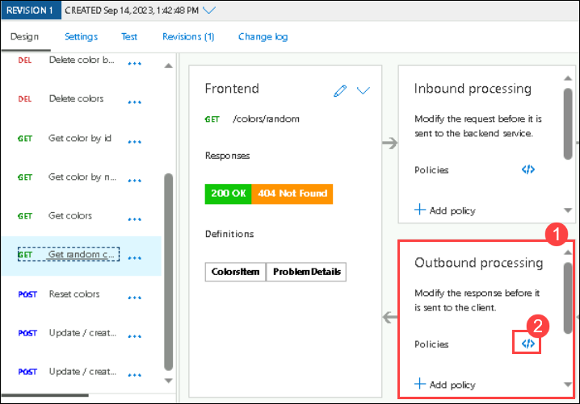
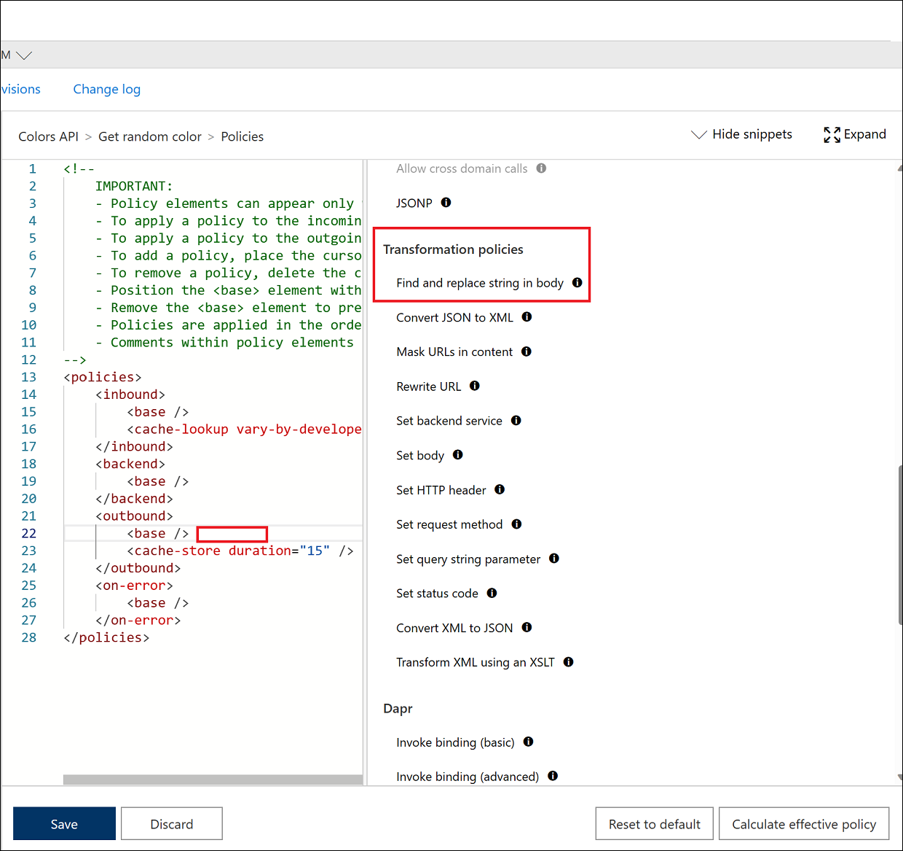
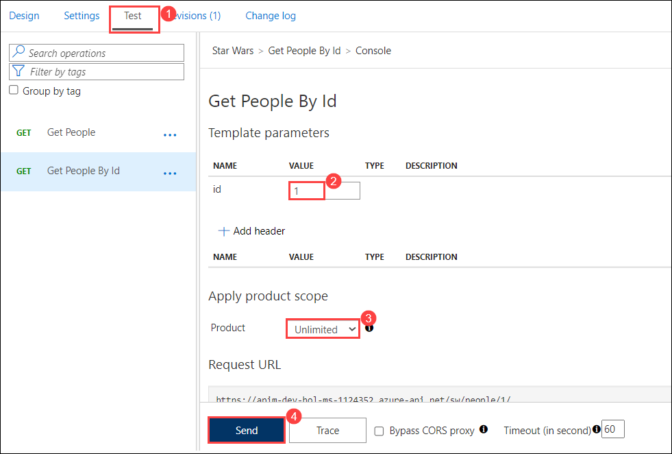
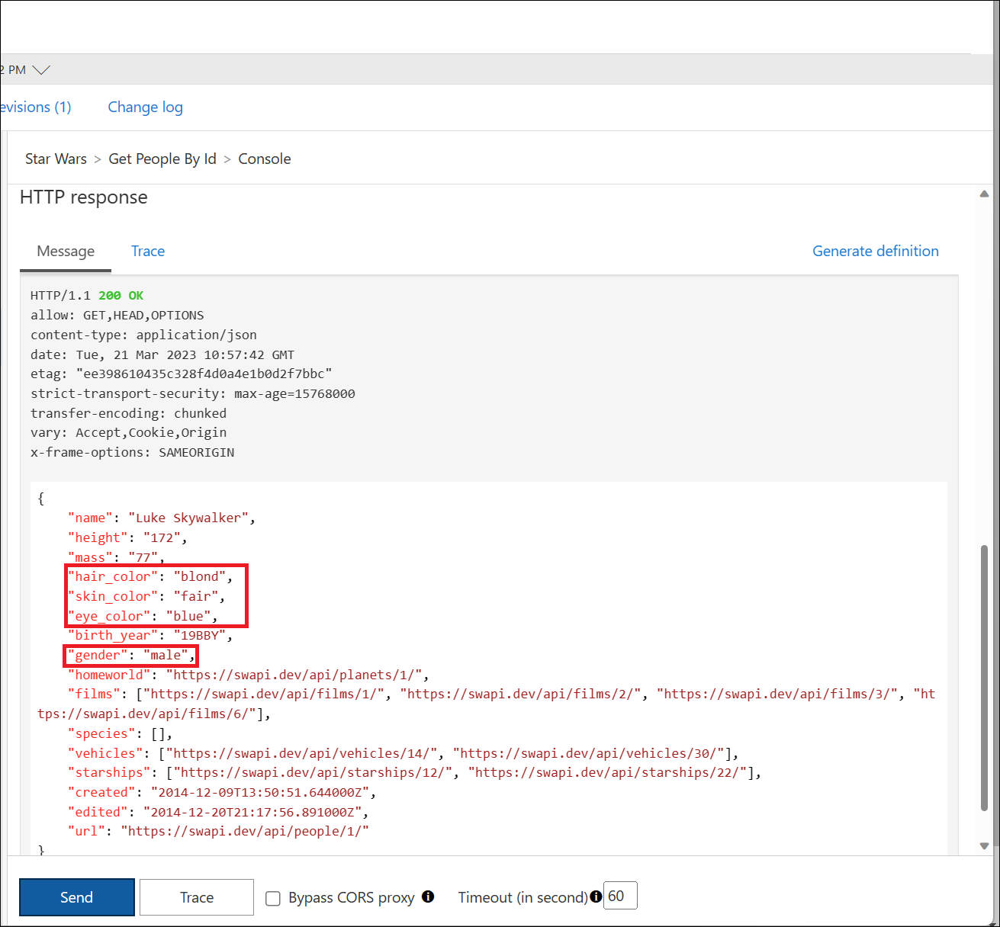
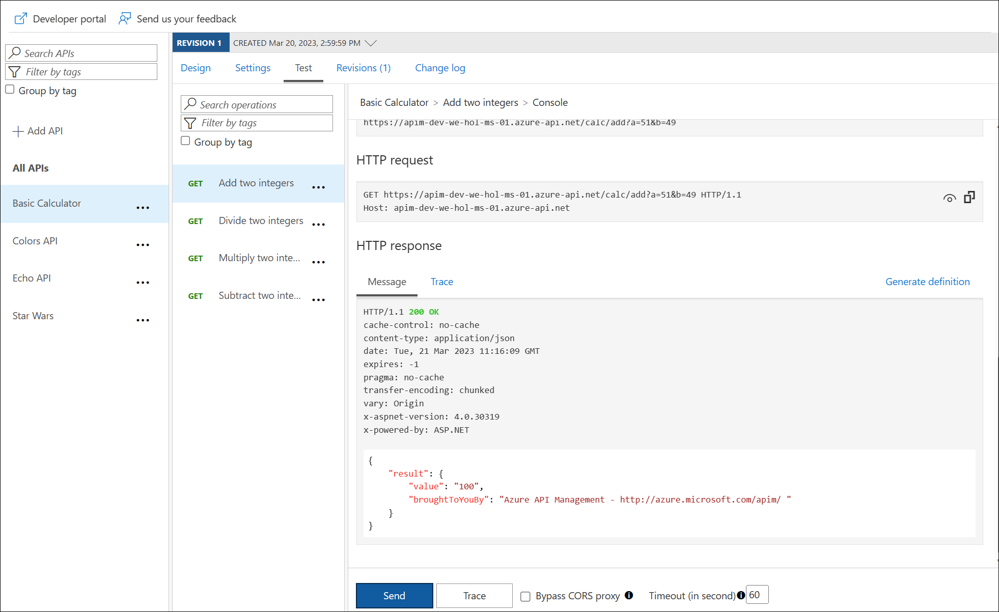
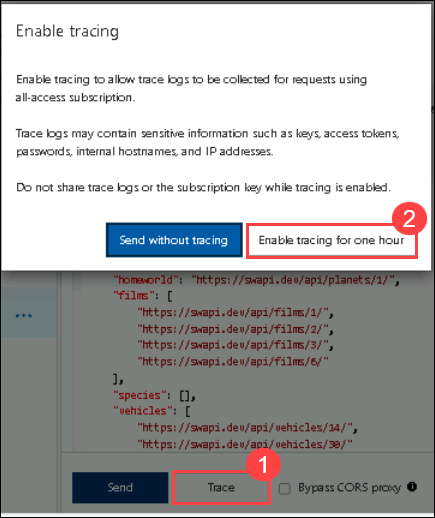
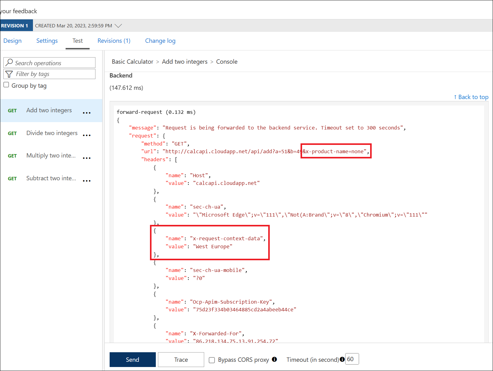

## Task 3: Transformation policies

### Task 3.1: Transformation - replace string

The **find-and-replace** policy finds a substring in a request or response and replaces it with a different string.

- Open **APIs (1)** and click the **Colors API (2)**, then select the **Get random color (3)** operation.

   
  
- In the **Outbound processing (1)** section, select **Policy code editor** with symbol **</>**.

   
  
- Place the cursor after the `<base />` element in the `<outbound>` section.
- Click on **Show snippets** present in the top right corner, then select the **Find and replace string in body** transformation policy.  

  

- Fill in the **`from` and `to` (1)** values accordingly and **Save (2)** the policy.

     ```xml  
    <outbound>
       <base />
       <find-and-replace from="blue" to="green" />
       <cache-store duration="15" />
   </outbound>
     ```

  

- Invoke the API using the Unlimited subscription key.

  

---

### Task 3.2: Transformation - conditional

Policies can be applied very granularly. In this example, you are modifying the **Star Wars** API to return a limited set of information if the caller is using the **Starter** subscription. Other products, such as the **Unlimited** subscription, will receive the full response.  

The [context variable](https://docs.microsoft.com/en-us/azure/api-management/api-management-policy-expressions#ContextVariables) that is implicitly available in every policy expression provides access to the `Response` and `Product` below. 

> **Note**: After saving any changes in the policy if you see this below pop-up, click on **Discard**.

   

- Click **Star Wars (1)** API, then select the **Get People By Id (2)** operation.

   
  
- Similarly to the **Colors** API, we will add the outbound policy to conditionally change the response body. Replace the existing entries in the operation with the entire `<policies>` code below.  
Note that the inbound `Accept-Encoding` header is set to `deflate` to ensure that the response body is not encoded as that causes the JSON parsing to fail.  

  ```xml
  <policies>
      <inbound>
          <base />
          <set-header name="Accept-Encoding" exists-action="override">
              <value>deflate</value>
          </set-header>
      </inbound>
      <backend>
          <base />
      </backend>
      <outbound>
          <base />
          <choose>
              <when condition="@(context.Response.StatusCode == 200 && context.Product?.Name != "Unlimited")">
                  <set-body>@{
                          var response = context.Response.Body.As<JObject>();

                          foreach (var key in new [] {"hair_color", "skin_color", "eye_color", "gender"}) {
                              response.Property(key).Remove();
                          }

                          return response.ToString();
                      }
                  </set-body>
              </when>
          </choose>
      </outbound>
      <on-error>
          <base />
      </on-error>
  </policies>
  ```

- Test the API on the **Test** **(1)** tab with **id** 1 **(1)** and apply the appropriate **Starter** or **Unlimited** **(3)** product scope. Examine the different responses.

  

- With **Starter** or **None** product scope:

  

- With **Unlimited** product scope. Notice the four properties in red that are not included in the **Starter** scope response.

  

---

### Task 3.3: Transformation - XML to JSON

A frequent requirement is to transform content, especially to maintain compatibility with legacy APIs. For this lab we are going back to the **Calculator** API that returned an XML response. 

- On **Design tab (1)**, select **Add two integers operation (2)**, then in **Outbound processing (3)** section click on **add policy icon `</>` (4)** to transform the response body to JSON.

  

  ```xml
  <outbound>
      <base />
      <xml-to-json kind="direct" apply="always" consider-accept-header="false" />
  </outbound>
  ```

- Test the API and examine the response. Note that it's now JSON.

  

### Task 3.4: Transformation - Delete response headers

A frequent requirement is to remove headers, especially ones that return security-related or superfluous information.

- Add an outbound policy to the same **Calculator** API operation to remove specific response headers.

  ```xml
  <outbound>
      <base />
      <xml-to-json kind="direct" apply="always" consider-accept-header="false" />
      <set-header name="x-aspnet-version" exists-action="delete" />
      <set-header name="x-powered-by" exists-action="delete" />
  </outbound>
  ```

- Invoke the API and examine the response, which now no longer contains the two headers. See above screenshot for how it looked prior.

  

### Task 3.5: Transformation - Amend what's passed to the backend

Query string parameters and headers can be easily modified prior to sending the request on to the backend. 

- Back in the same **Calculator** API operation, add **inbound Processing** policies to modify the query string and headers. 

  ```xml
  <inbound>
      <base />
      <set-query-parameter name="x-product-name" exists-action="override">
          <value>@(context.Product?.Name ?? "none")</value>
      </set-query-parameter>
      <set-header name="x-request-context-data" exists-action="override">
          <value>@(context.Deployment.Region)</value>
      </set-header>
  </inbound>
  ```

- Test the call by using either the **Starter** or **Unlimited** product, click on Trace button and then inspect the result on the **Trace** tab. If Tracing is not enabled, press **Enable Tracing**, and on the Pop-up select **Enable Tracing for one hour**.

  

- In the **Trace tab**, select **Backend**.

  

  

---
### Summary
In these transformation tasks, you implemented various policies in Azure API Management:

1)You applied find-and-replace policies to modify response strings in the Colors API.

2)Conditional policies were used in the Star Wars API to customize responses based on subscription tiers.

3)You transformed XML to JSON in the Calculator API and removed specific response headers.

4)Query string parameters and headers were dynamically modified using inbound policies in the Calculator API.

- Now, click on Next from the lower right corner to move on to the next page.
