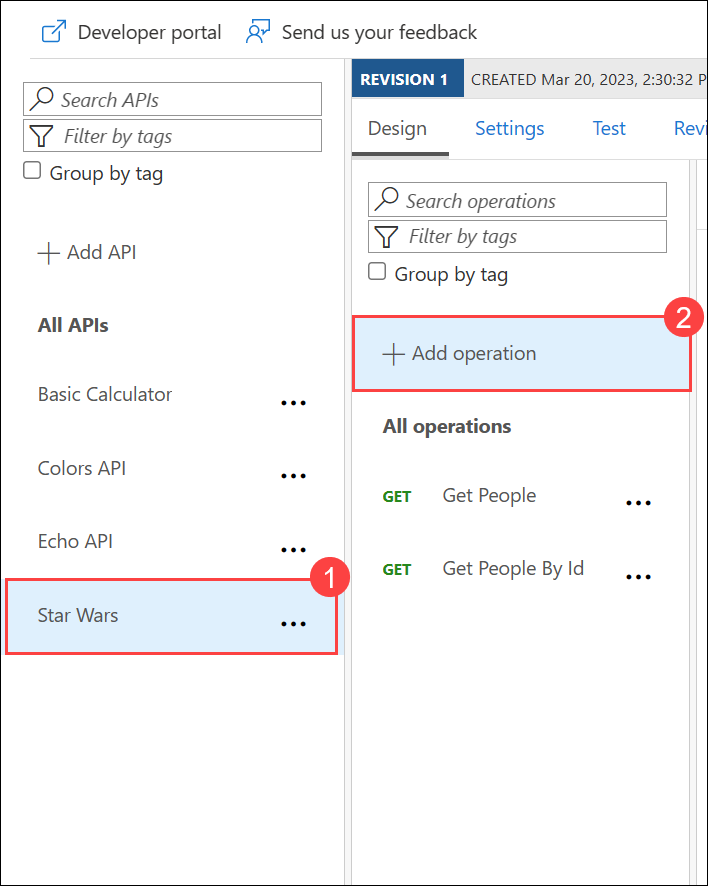
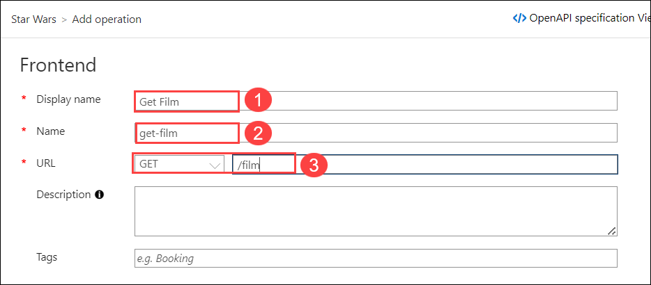
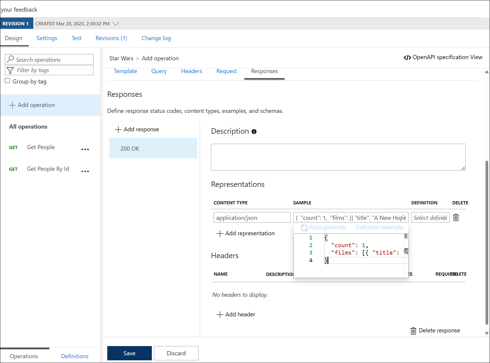
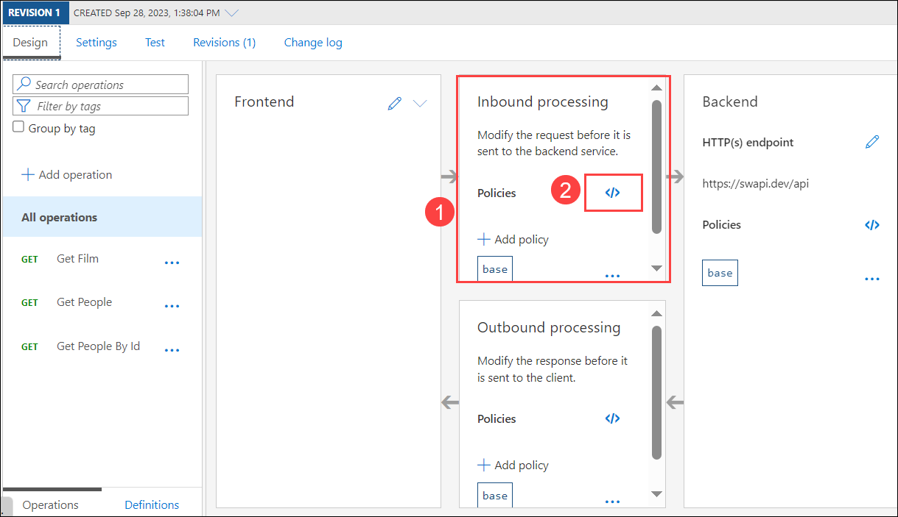
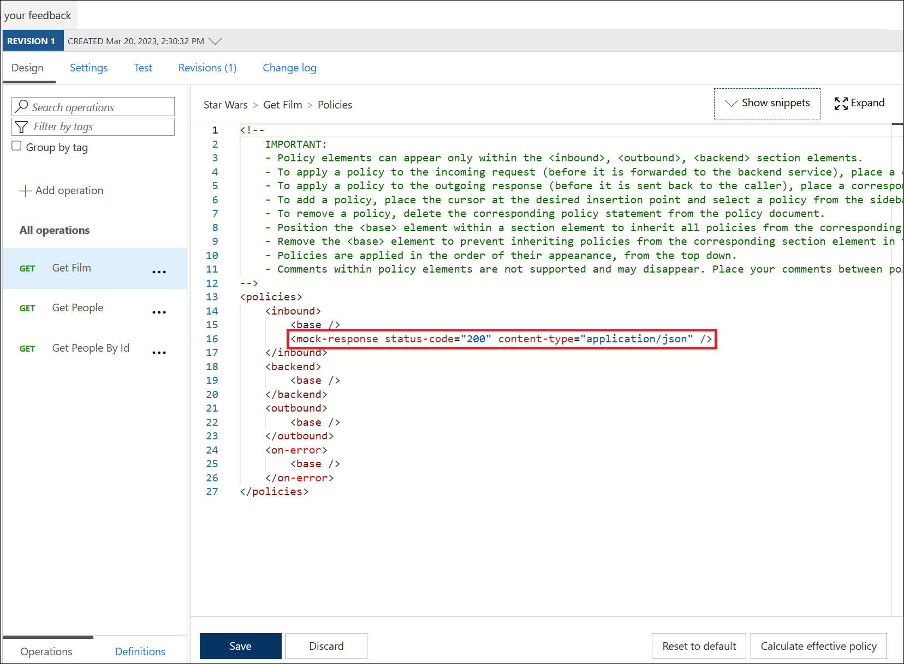
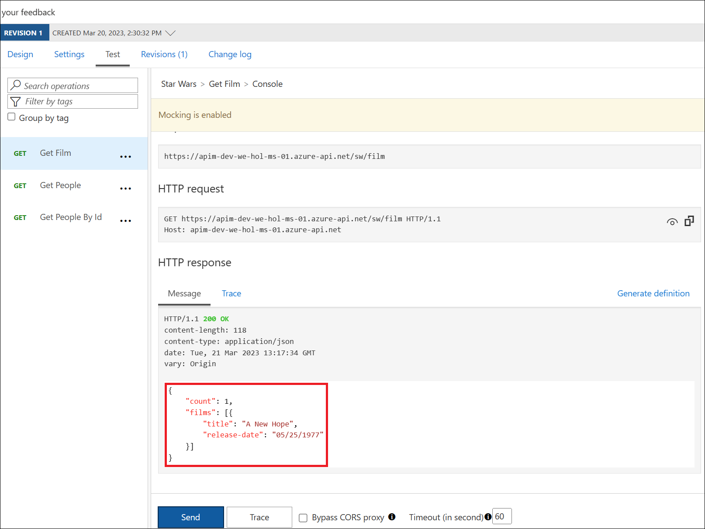

## Continuation for Exercise 4,Task 5: Mock policy

### Mock responses

Mocking in Azure API Management is a useful mechanism for API consumers to interact with APIs without waiting for the backend to be ready. 

1. Open the **Star Wars** API and select **+ Add Operation**

    

1. Create a new GET operation:
    - Display name: **Get Film**
    - Name: **get-film**
    - URL: **/film**
 
      
  
1. Under the Design tab, in the **Responses** configuration tab, press **+ Add response**, Select `200 OK`.

1. Click on **+ Add representation** under Representations, from the content-type  drop-down select `application/json` and add this below sample data under **Sample**:

    ```json
    {
      "count": 1,
      "films": [{ "title": "A New Hope", "release-date": "05/25/1977" }]
    }
    ```
  
      

1. Click on **Save**.
1. Under **Inbound processing (1)** section , click on **Policy code editor (2)**

      
  
1. Add **Mock Response** under **Other policies** after the `<base />` tag and click on **Save**.

    ```xml    
    <inbound>
        <base />
        <mock-response status-code="200" content-type="application/json" />
    </inbound>
    ```

      

1. Invoke the API from the **Test** tab to receive a `200` success with the mocked film data .

    

> **Congratulations** on completing the task! Now, it's time to validate it.
<validation step="3083e0a3-97d5-46ce-bdf3-7c9e6cd526e7" />
---

## Summary 
In Azure API Management, a "Get Film" operation is created for the Star Wars API. This operation returns a mock response with a 200 OK status code and sample JSON data containing film information. An inbound policy is added to simulate the mock response, and when the API is invoked, it returns a 200 success status with the mocked film data.

### Now, click on Next from the lower right corner to move on to the next page for further tasks.
