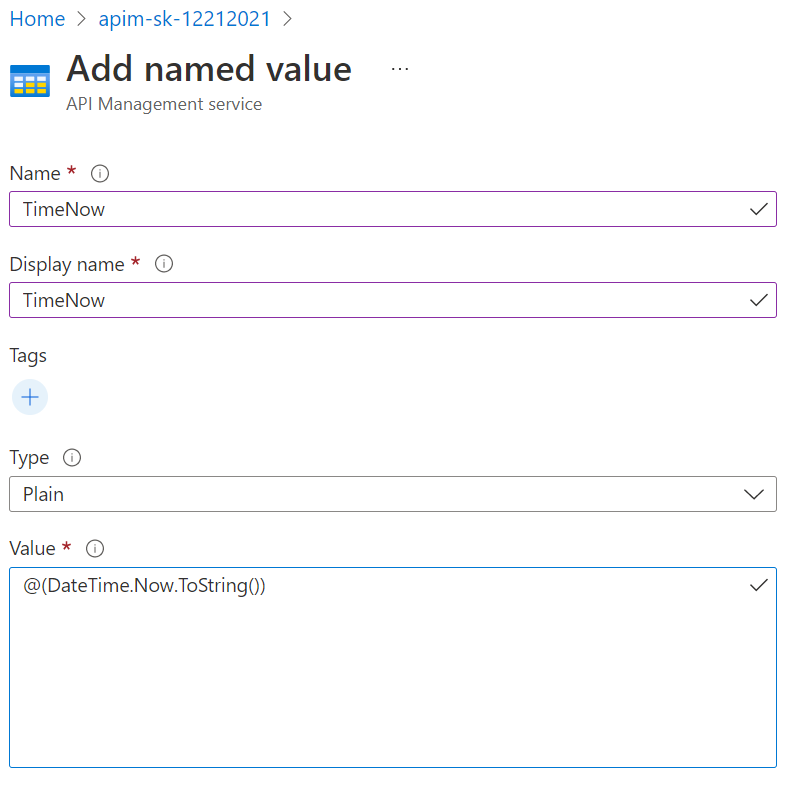

## Calculator API

### Named Values collection

Named Values (aka Properties) are a collection of key/value pairs that are global to the service instance. These properties can be used to manage constant string values across all API configurations and policies.  Values can be expressions or secrets (never displayed).

- Set a property called `TimeNow`
  - e.g. `@(DateTime.Now.ToString())`



- Open the Calculator API 'Code View'
- Add the inbound policy to add the header
- Test the API within the Azure Management portal
  - Add a Header called [Ocp-Apim-Trace] set to true
  - Examine the response and the [Trace] tab

```xml
<!-- Inbound -->
<set-header name="timeheader" exists-action="override">
    <value>{{"{{TimeNow"}}}}</value>
</set-header>
```


- Go to the URL specified in the HTTP Response - [ocp-apim-trace-location]
  - Note that the [timeheader] field has been sent to the backend API

