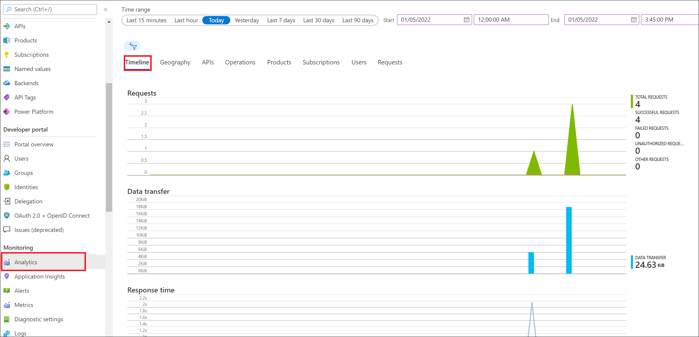
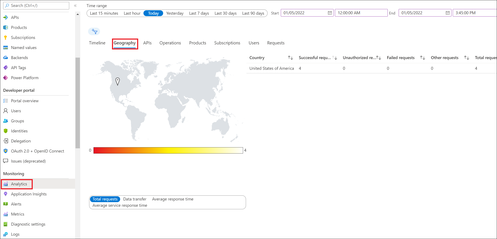
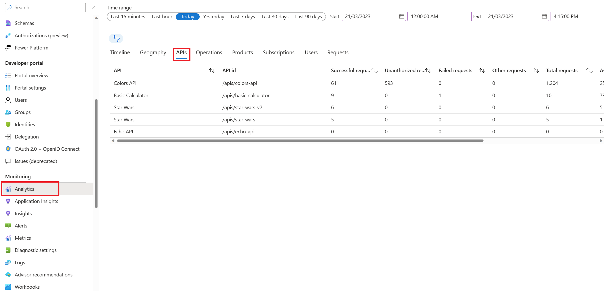

# Exercise 6: Analytics & Monitoring

## Overview

In this exercise, you'll set up Azure Monitor and Application Insights to track and analyze API performance. The focus is on collecting metrics, monitoring usage, and gaining insights into API health, which aids in optimizing performance and ensuring the reliability of your API services.

## Lab objectives

You will be able to complete the following tasks:

**Task 1**: Basics Monitoring with Azure Monitor

**Task 2**: How to integrate Azure API Management with Azure Application Insights

Task 2.1: Create an Azure Application Insights instance

Task 2.2: Create a connection between Azure Application Insights and Azure API Management service instance

Task 2.3: Enable Application Insights logging for your API

Task 2.4: Viewing Azure Application Insights Data

**Task 3**: Event Hub Overview

Task 3.1: Create an Event Hubs namespace

Task 3.2: Create an Event Hub

Task 3.3: Create Access to the Event Hub

Task 3.4: Create an Azure API Management logger

Task 3.5: Configure log-to-eventhub policies

Task 3.6: Verify Events are logged in Event Hub

## Task 1: Basics Monitoring with Azure Monitor

Analytics is available on the _Analytics_ blade in APIM.

1. On the left hand pane, click on **Analytics (Classic)** under Monitoring in API Management Service.

1. The dashboard has several tabs on it. For example, here are _Timeline_, _Geography_, and _APIs_:

      

      

      

- Now, click on Next from the lower right corner to move on to the next page.
