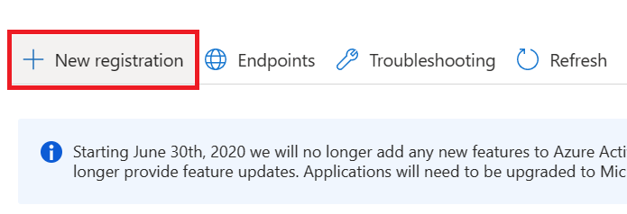

## Authorization Code

In Authorization code grant type, User is challenged to prove their identity providing user credentials. Upon successful authorization, the token end point is used to obtain an access token. The obtained token is sent to the resource server and gets validated before sending the secured data to the client application.

### Register an application (backend-app) in Azure AD to represent the Colors API​

To protect an API with Azure AD, first register an application in Azure AD that represents the API. The following steps use the Azure portal to register the application.

**First we need to access our the AAD tenant we created in the excercise before, be sure you are in the right tenant**. Then select App registrations under Azure Portal to register an application:

- Select New registration.

- In the Name section, enter a meaningful application name that will be displayed to users of the app.
- In the Supported account types section, select an option that suits your scenario.
- Leave the Redirect URI section empty.
- Select Register to create the application.

- On the app Overview page, find the Application (client) ID value and record it for later.

- Select Expose an API and set the Application ID URI with the default value. Record this value for later.
- Select the Add a scope button to display the Add a scope page. Then create a new scope that's supported by the API (for example, Colors.Read).
- Select the Add scope button to create the scope. Repeat this step to add all scopes supported by your API.
- When the scopes are created, make a note of them for use in a subsequent step.

### Register another application (client-app) in Azure AD to represent a client application that needs to call the API.​

### Enable OAuth 2.0 in the Developer Console for Authorization Code Grant type

### Validate-jwt policy to pre-authorize requests with AD token:
