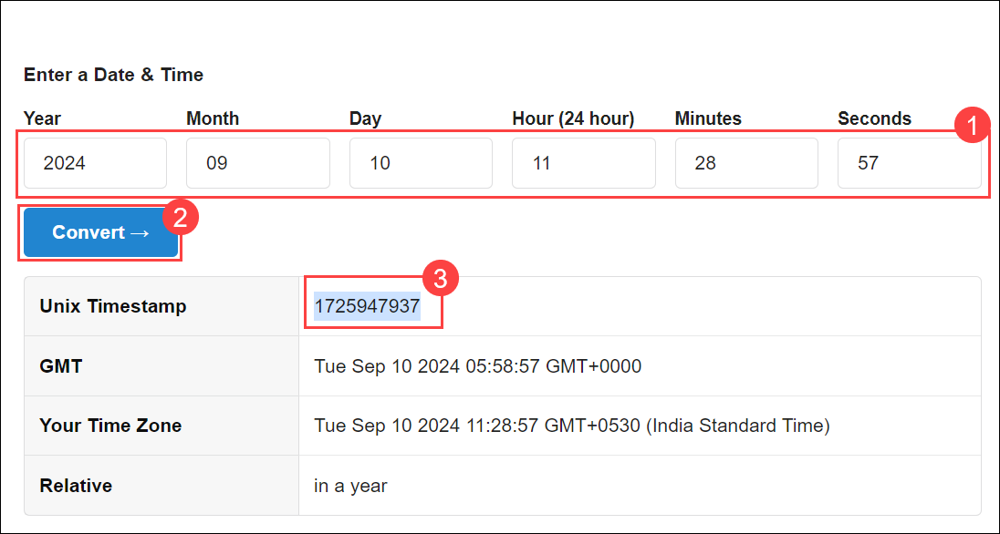
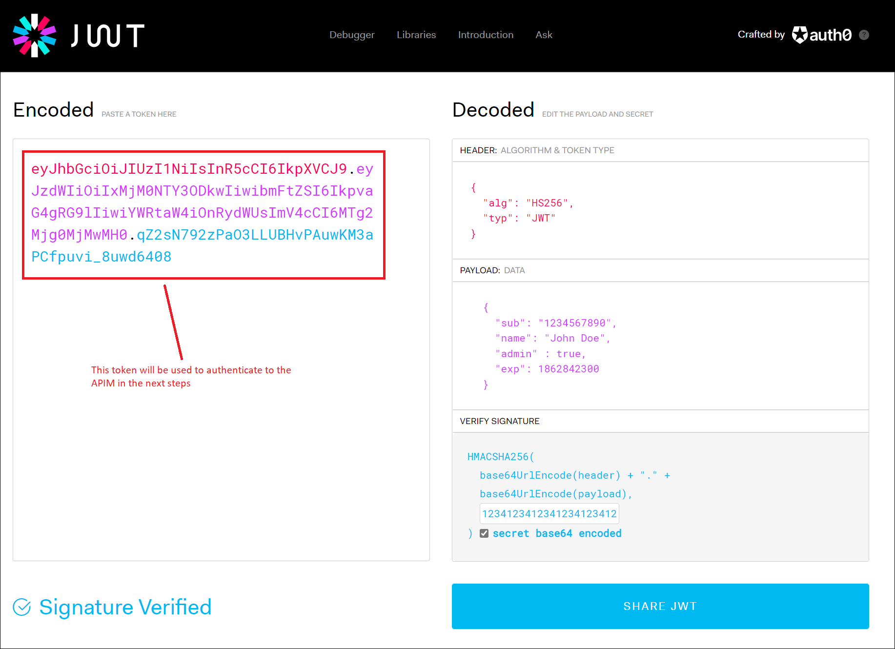
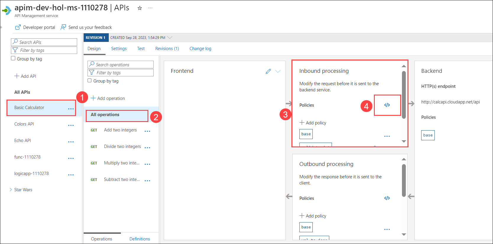
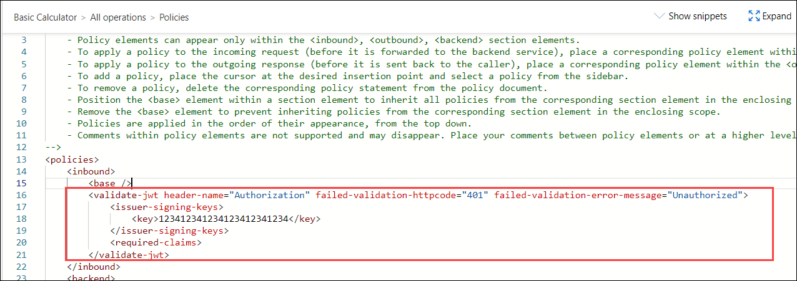
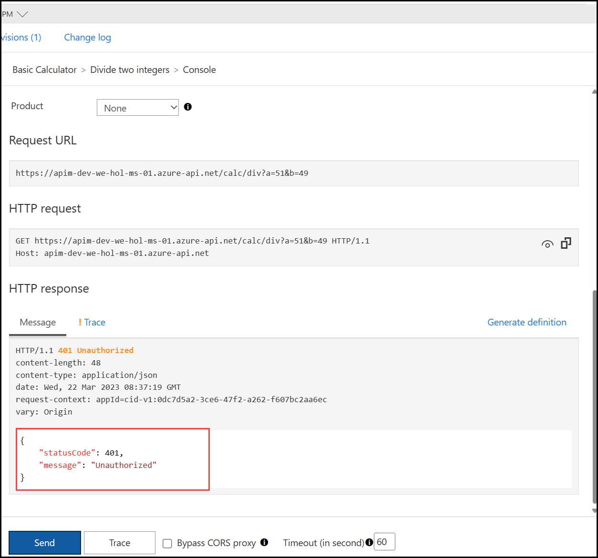
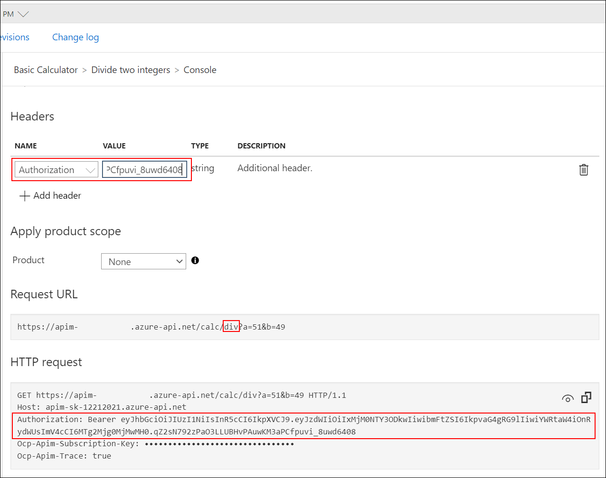
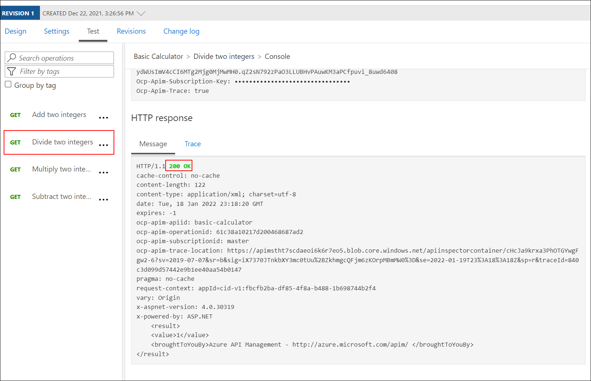
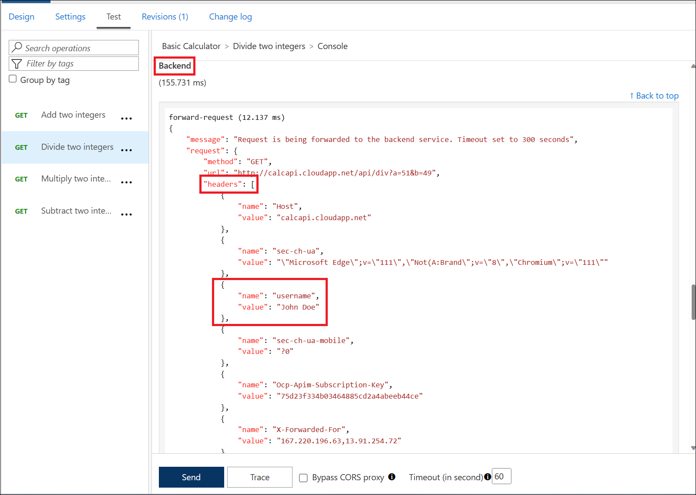

# Exercise 7: Security 
## Overview
APIM focuses heavily on security in all three major areas of the product. Going into detail on each aspect is a large topic entirely of its own. Therefore, in this section we will focus more narrowly on one of the common approaches to secure access to an API.

## JSON Web Tokens (JWT)

In this lab, we are going to see how to use JSON Web Tokens with your APIs.

### Task 1.1: Creation

JSON Web Tokens are an open-industry standard method for representing claims securely between two parties. More info at <https://jwt.io>. 

Use the following sites:
1. <https://www.unixtimestamp.com> to get a future date using the Epoch Unix Timestamp, **make sure to add the date or time _at least one hour from the current time_** as the JWT will not work otherwise (e.g. 01/11/2029 = `1862842300`).
1. Copy the Unix TImestamp value in a notepad.

   

1. <https://jwt.io> to create a JWT with payload. In the **Decoded** section make these changes:
    - Leave the **Header** as it is.
    - Use the following **Payload** format and replace the `exp` value with your newly-created Unix timestamp:

        ```json
        {
        "sub": "1234567890",
        "name": "John Doe",
        "admin" : true,
        "exp": 1862842300
        }
        ```

    - In the **Verify Signature** area use a 256-bit key that will also be used in the Azure API Management policy. We used `123412341234123412341234` as an example, which is rather a weak secret but serves the demo purpose.
    - Check **secret base64 encoded**.
    - Your configuration should be similar to this now:

        

### Task 1.2: Validation

1. Back in APIM, open the **Calculator** API and select **All operations**.
  
1. In the **Code View** add an inbound `validate-jwt` policy with the signing key.

   

    ```xml
        <inbound>
            <base />
            <validate-jwt header-name="Authorization" failed-validation-httpcode="401" failed-validation-error-message="Unauthorized">
                <issuer-signing-keys>
                    <key>123412341234123412341234</key>
                </issuer-signing-keys>
            </validate-jwt>
        </inbound>
    ```

    

1. Invoke the **Divide two integers** method on the API from the **Test** tab. Observe the `401` Unauthorized error.

    

1. Now add the following `Authorization` header to the test:

    - Name: `Authorization`
    - Value: `Bearer <jwt token>` 
    - Replace `<jwt token>` with the **encoded** value from <https://jwt.io> above

        Note the bearer token in the Request payload.

        

1. Execute the test once more to see a `200` Success. 

    

### Task 1.3: Check that a Claim Exists

Not only is it important that a JWT is valid, but, as we use it for authorization, we must also assert that the token contains expected claims before granting access to our APIs.

1. Open the **Calculator** API and select **All operations**.
1. Modify the inbound `validate-jwt` policy to not only validate the JWT but ensure that a specific `admin` claim exists. Recall that we set `admin`: `true` in our JWT token on <https://jwt.io> above.

    ```xml
    <inbound>
        <base />
        <validate-jwt header-name="Authorization" failed-validation-httpcode="401" failed-validation-error-message="Unauthorized">
            <issuer-signing-keys>
                <key>123412341234123412341234</key>
            </issuer-signing-keys>
            <required-claims>
                <claim name="admin" match="any">
                    <value>true</value>
                </claim>
            </required-claims>
        </validate-jwt>
    </inbound>
    ```

1. Invoke the **Divide two integers** method with the `Authorization` header as above and observe the `200` success. We have not fundamentally changed the test scenario as we only restricted the claims to something that we already had in our payload.

1. Now change the `required-claims` with a claim  that does not exist (e.g. `adminx`)

    ```xml
    <inbound>
        <base />
        <validate-jwt header-name="Authorization" failed-validation-httpcode="401" failed-validation-error-message="Unauthorized">
            <issuer-signing-keys>
                <key>123412341234123412341234</key>
            </issuer-signing-keys>
            <required-claims>
                <claim name="adminx" match="any">
                    <value>true</value>
                </claim>
            </required-claims>
        </validate-jwt>
    </inbound>
    ```

1. Invoke the **Divide two integers** method with the `Authorization` header once more and observe the `401` Unauthorized error as the token specifies `admin` but the policy requires `adminx`.

### Task 1.4: Extract Claim and Pass to Backend

It may often be necessary to pass (specific) claims onto the backend API to inform further processing. One such way - and this can be tailored to an API's individuality - is to extract a claim and place it into a designated header the backend expects.

Let's add the username contained inside the JSON Web Tokens into a specific header.

1. Open the **Calculator** API and select **All operations**.
1. Append the inbound policy section to extract the `name` claim and place it into a header underneath the `validate-jwt` policy.
1. Change the claim back from `adminx` to `admin` as we are interested in a successful test again.

    ```xml
    <inbound>
        <base />
        <validate-jwt header-name="Authorization" failed-validation-httpcode="401" failed-validation-error-message="Unauthorized">
            <issuer-signing-keys>
                <key>123412341234123412341234</key>
            </issuer-signing-keys>
            <required-claims>
                <claim name="admin" match="any">
                    <value>true</value>
                </claim>
            </required-claims>
        </validate-jwt>
        <set-header exists-action="override" name="username">
            <value>@{
                Jwt jwt;
                context.Request.Headers.GetValueOrDefault("Authorization","scheme param").Split(' ').Last().TryParseJwt(out jwt);
                return jwt.Claims.GetValueOrDefault("name", "?");
            }</value>
        </set-header>
    </inbound>
    ```

1. Invoke the **Divide two integers** method with the `Authorization` header once more and observe the `200` Success.
1. Use the **Trace** feature to inspect what was passed to the backend. You should see the new header and the correct value from the claims.

    

### Improvements

Based on what you have learned thus far, consider how you can improve your policies. For example, you may not want to hard-code the `issuer-signing-key` and instead use a Named Value that you can more easily administer and change outside of an API's policies. If you have time in this exercise, go ahead and give it a try.

- Now, click on Next from the lower right corner to move on to the next page.
