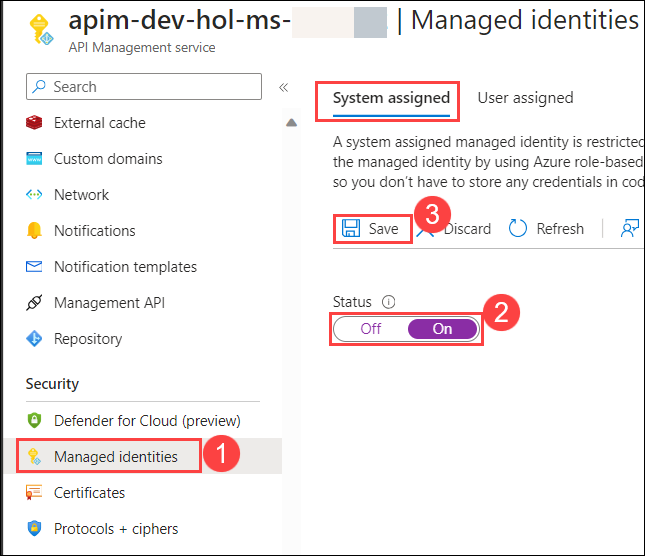
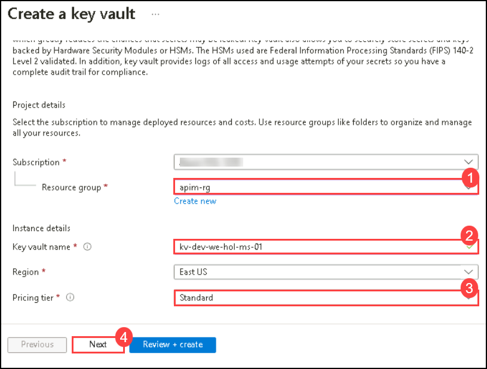
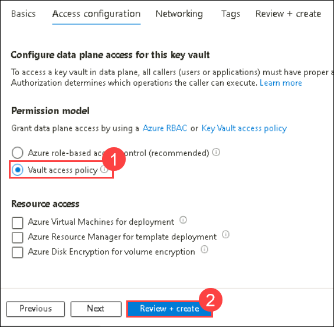
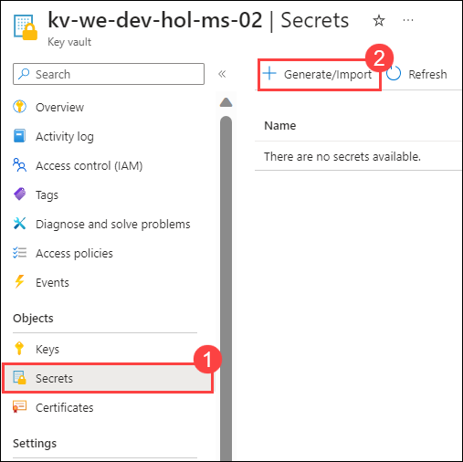
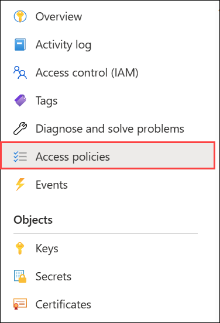
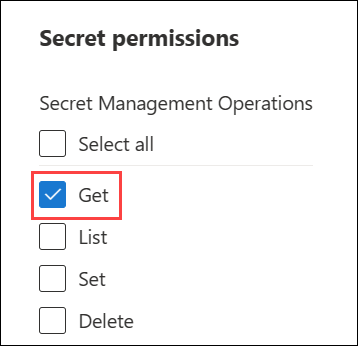
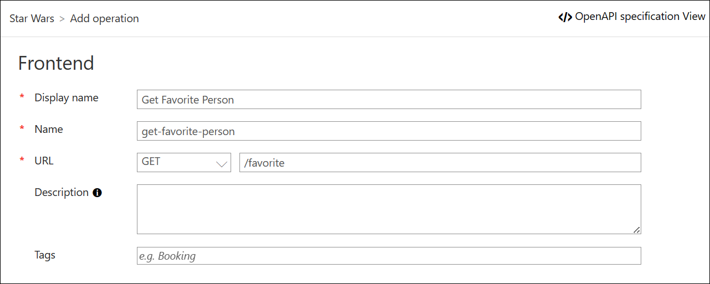

## Continuation for Exercise 7,Task 2: Managed Identities

In Azure, an Active Directory identity can be assigned to a managed resource such as an Azure Function, App Service or even an Azure API Management instance. Once an identity is assigned, it has many capabilities to work with other resources that leverage Azure AD for authentication, much like a service principal.

### Task 2.1: Register Azure API Management with Active Directory

1. Navigate to your **API management** instance, select **Managed identities** **(1)** from the pan, set the Status to **On** **(2)**, and click on **Save** **(3)** system-assigned identity.

    

1. On **Enabled system assigned managed identity** pop-up click on **Yes**.

> **Congratulations** on completing the task! Now, it's time to validate it.
<validation step="114baa5f-6313-469d-932a-033f7744f3d2" />

## Key Vault 

### Task 2.2: Create Key Vault and add a secret

1. Search for **Key Vault** in the Azure portal and Select **Create**.
1. Select Resource Group: **apim-rg**
1. Enter Key Vault Name: **kv-dev-hol-ms-<inject key="Deployment ID" enableCopy="false" />**

    

1. Click on **Next**.
1. In the **Access configuration** tab, check the box for vault access policy and click on **Review + Create**.

      

1. In **Review + Create** tab, click on **Create**.

1. Once created, click on **Go to resource**, this will open recently created **key-vault**.
  
1. Next, select **Secrets** under Objects on the left hand pane, and click on **Generate/Import**.

      

1. Provide the below details and click on **Create**.
   
    - Name:`favoritePerson`
    - Secret value: `3`

> **Congratulations** on completing the task! Now, it's time to validate it.
<validation step="c496182a-286f-4509-b2e7-43d5c1dd6403" />

### Task 2.3: Access policy and principal assignment

1. Create an **Access policy**.

      

1. Click on **+ Create**.

1. Select the `Get` operation from the list of Secret permissions.

      

1. Select the principal and search for the name of your **Azure API Management instance** and select it. Click on **Next**

    

1. Click on Next again and click on **Create**.

    You should see something like this:

    

### Task 2.4: Azure API Management, Key Vault and Managed Service Identity

1. Go back to your **APIM**.
1. Navigate to the **APIs** tab from the left pane.
1. Add a new **Operation(+ Add Operation)** to the **Star Wars** API and choose **Original** in the dropdown and provide the following values:
  
    - **Display Name: Get Favorite Person**
    - **URL: /favorite** 

      

1. Click on **Save**.

1. Navigate to the Inbound processing tab in this operation.
   
1. Update the policies for **this** new operation, and click on **Save**.

    ```xml
    <inbound>
      <base />
      <send-request mode="new" response-variable-name="secretResponse" timeout="20" ignore-error="false">
          <set-url>https://{your-keyvault-name}.vault.azure.net/secrets/favoritePerson/?api-version=7.0</set-url>
          <set-method>GET</set-method>
          <authentication-managed-identity resource="https://vault.azure.net" />
      </send-request>
      <set-variable name="favoritePersonRequest" value="@{
          var secret = ((IResponse)context.Variables["secretResponse"]).Body.As<JObject>();
          return "/people/" + secret["value"].ToString() + "/";
      }" />
      <rewrite-uri template="@((string)context.Variables["favoritePersonRequest"])" />
    </inbound>
    ```

    >**Note**: Don't forget to change the `set-url` value with your Key Vault name.

### Task 2.5: Test the operation

1. Sign in to the developer portal and test this new operation
1. Notice the request URL will be similar to: **https://apim-dev-hol-ms-<inject key="Deployment ID" enableCopy="false" />.azure-api.net/sw/favorite**

---
### Summary 
In this Task, Azure API Management (APIM) is configured to securely access secrets from Azure Key Vault using Managed Service Identity (MSI), enhancing security and enabling the retrieval of secrets for API management operations, as demonstrated during testing in the developer portal.

### Now, click on Next from the lower right corner to move on to the next page.
