# Exercise 8:  Fusion Dev
## Overview

In this exercise, you'll create a Star Wars Fan Club mobile application using Power Apps and Azure API Management. You'll connect your member data from an Excel worksheet, integrate Star Wars character information through a custom connector, and customize the app to display favorite character details for each member.

## Task 1: Power Apps and APIM

The *premier* Star Wars Fan club is growing and the club officers would like to upgrade from their existing member tracking worksheet to a mobile application that would be available to their members all over the world. The members would also like to see information about their favorite Star Wars movies and characters in the application that would update as new shows and movies are released.

In this exercise, you will be using [Star Wars API](https://swapi.dev/) with the Azure API Management instance that you created [in part three](../3-adding-apis/adding-apis-3-1-from-scratch.md) of this lab. The Excel worksheet of member profiles will serve as the primary backing data source and will be used to generate a base application. You will export the Star Wars API from Azure API Management as a Power Platform Custom Connector so that the Canvas App can access real-time Star Wars character information. For each of the Fan Club members, you can then search the Star Wars API character data and show information about their favorite character in the Canvas App.

> *Note: This exercise requires access to Power Apps Premium connectors. Sign up for a [free Developer Plan](https://powerapps.microsoft.com/en-us/developerplan/).* Use the credentials given in the lab environment to sign up for a Developer Plan.

### Task 1.1: Update CORS policy

1. Check Azure API Management, under Developer Portal select Portal Overview to see if CORS has been enabled globally. Here's what the Portal overview will look like if CORS has been enabled:

   
 
1. Now go to **All APIs (1)**, and click on **edit icon (2)**.

   

1. Add https://flow.microsoft.com and https://make.powerapps.com as allowed origins.

   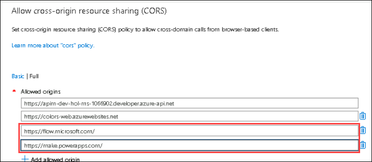


### Task 1.2: Create a custom connector

>*Note*: Before proceeding further make sure you are signed in the Power platform with the given credentials in the resources tab.

1. Click on **Power platform** option from your Azure API Management instance, and select **Create a connector.**

   

2. Enter the following details:

   - API : Select the **Star wars (1)** API 
   - Power Platform Environment: From the dropdown select **ODL_User XXXX Environment (2)**.
   - Display Name: **Star Wars API (3)**
   - Click on **Create (4)**.

     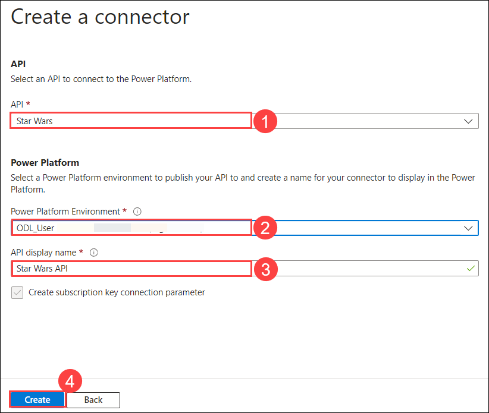

If you are unable to create a Power Connector from Azure API Management, you can also export an `OpenAPI v2 (JSON)` file that can be imported as a Custom Connector within the Power Platform. You can find a sample [here](https://github.com/Azure/apim-lab/blob/main/apim-lab/9-fusion-dev/Star%20Wars%20API.swagger.json).

### Task 2: View your custom connector in Power Platform

1. Go to [https://make.powerapps.com](https://make.powerapps.com/) and sign in.

1. Select **Data** from the left pane, and then select **More**  and click on discover **Discover all** to see your generated custom connector to your Azure API Management API.
   
   

1. Scroll down and select **Custom Connectors**.

   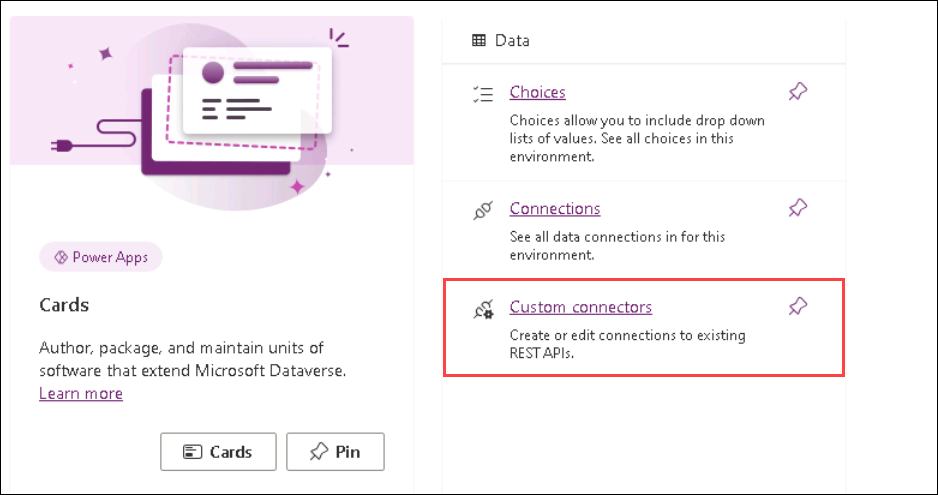

1. You can view the recently created **Star Wars API** custom connecter. From here, select the pencil icon to edit the custom connector.

   
 
1. On the top left corner, from the drop-down select **Definition** screen, we need to define a search query string for people so that the Power App can search for character records by name.

   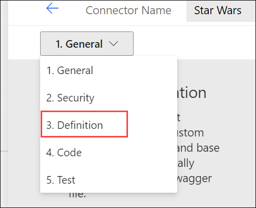

1. Select the `GetPeople` action, and in the **Request** section, select **+ Import from sample**. Enter a sample request URL with the search query string:

   - **https://apim-dev-hol-ms-<inject key="Deployment ID" enableCopy="false" />.azure-api.net/sw/people?search=Luke**
       
      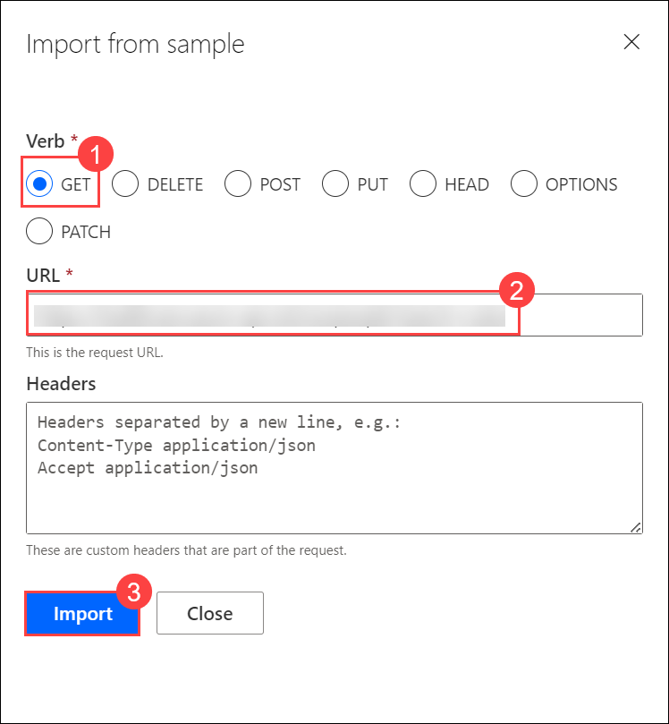

      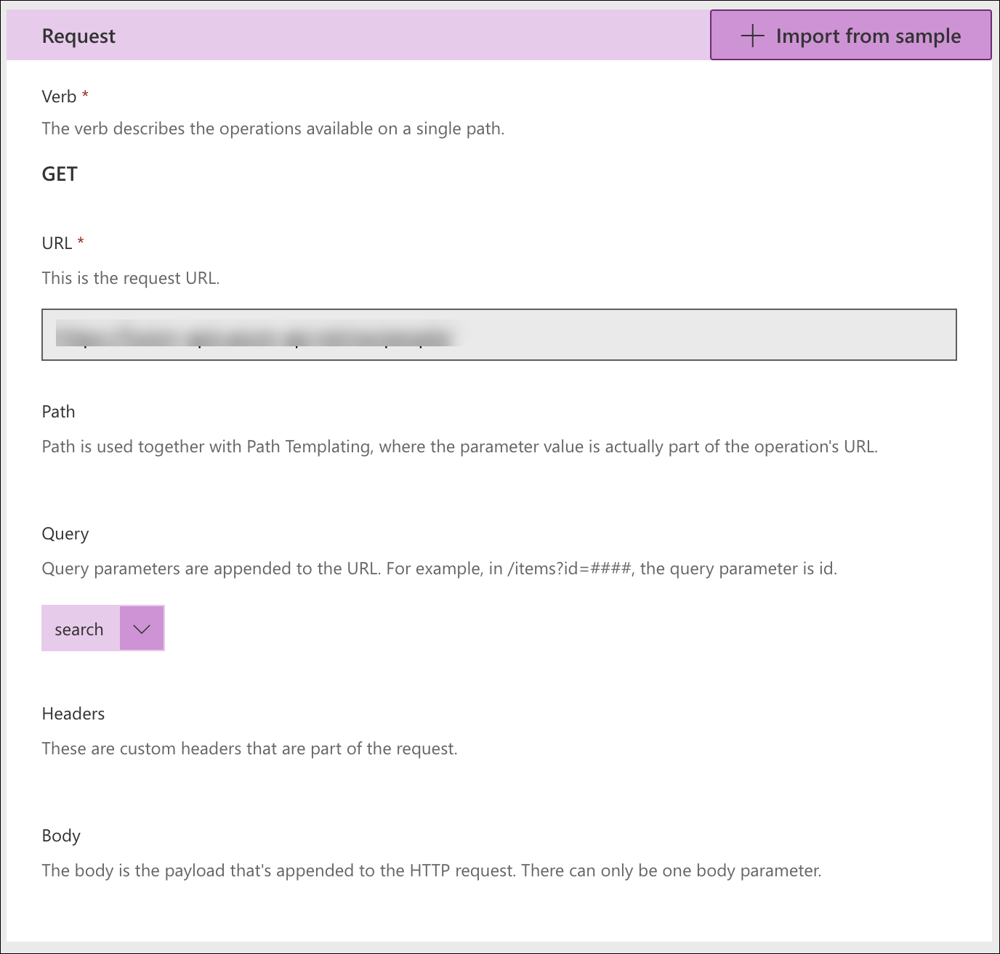

1. In the **Response** section of the `getpeople` action, select the `200` response and then select **+ Import from sample**. Copy and paste a sample JSON response into the `Body` section of the response. Close the import panel and select **Update connector**. 

   - Navigate back to the Azure API Management instance Invoke `getpeople`, and copy the Response into a notepad. 

      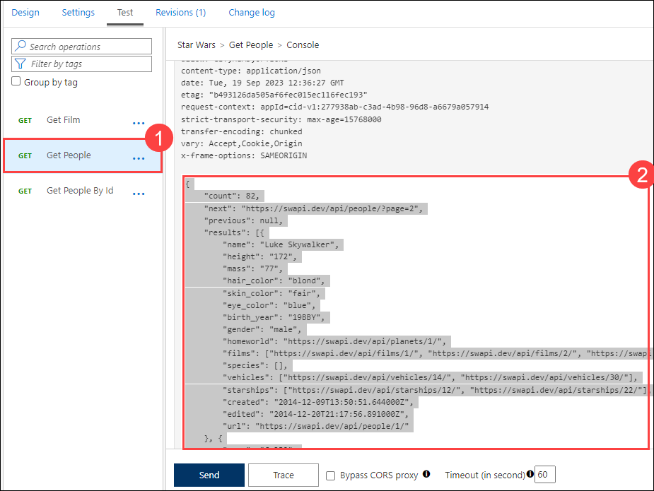
  
   - Paste the response into the `Body` section of the response.

      

      

1. Repeat this import for the `getpeoplebyid` action.

   >**Note:** Delete if you have other **Actions** Apart from `getpeople` and `getpeoplebyid`.

1. In the **Policies** section select + New policy.

1. Fill out the new policy with the following information:

     - **Name: set-origin-header**
  
     - **Template: Set HTTP header**
  
     - **Header name: Origin**
  
     - **Header value: https://make.powerapps.com**
  
     - **Action if the header exists: override**
  
     - **Run policy on: request**

       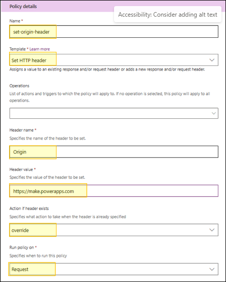

1. Next, **Update connector**.

1. From the top left corner select **Test** screen, and create a new connection instance in the **Connections** section. If prompted to provide the subscription key, navigate to Azure Portal and you can find the subscription key in the API Management Service, under APIs click on **Subscriptions (1)**, click on **Show/hide keys (2)**. Copy the **Primary key (3)** of the **unlimited** subscription.  

      

1. Navigate back to the **Custom Connectors** page and edit the Star Wars API again. Return to the **Test** page and test each of the API actions.

   

## **Task 3: Generate the Star Wars Fan Club Application**

### Task 3.1: Connect to the backing data source

1. Login to [Onedrive](https://onedrive.live.com/login/).

   > **Note:** Use the following credentials for Onedrive for business.
    
    * Email/Username: <inject key="AzureAdUserEmail"></inject>

    * Password: <inject key="AzureAdUserPassword"></inject>

2. Click on Files Upload, in the Jump VM, navigate to **C:\LabFiles\fanclubmembers.xlsx** path, and upload **fanclubmembers.xlsx**  to your OneDrive for Business account.

   
 
3. Navigate back to Power Apps Editor, in the left pane, select **Home**.

4. Under **Create** , select **Excel** and then Create **New connection** with **OneDrive for Business**.

   
   
5. Under **Connections** , select **OneDrive for Business** and browse to the file location. 

6. Under **Choose an Excel file** , select the **FanClubMembers.xlsx** file.

7. Under **Choose a table** , select the **Members** table.

8. Select **Connect** on the bottom right.

9. Power Apps will generate the app by inspecting your data and matching it with Power Apps screens.

## **Task 4: Add Favorite Character information**

Your generated app will now be in edit mode in the Power Apps Studio.

### Task 4.1: Add the Star Wars API Data Source

1. Select **Data (1)** from the left pane and then select **+ Add data (2)** from the drop-down menu.

2. Search for **Star Wars (3)** in the search field and choose the connection to the **Star Wars API (4)**.

     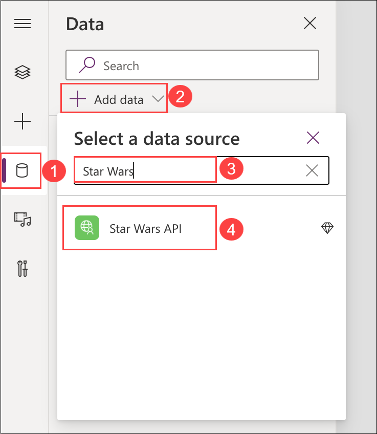

### Task 4.2: Customize the generated app

Your generated app will now be in edit mode in the Power Apps Studio.

You can customize your app theme using the **Theme** drop-down menu and selecting an option. You can change or format the fields that are shown in the Gallery by selecting **Tree view** in the left pane, clicking on BrowseGallery1, and making edits in the right formatting pane.


### Task 4.3: Add controls to the View Detail screen

1. In the Tree view, select **DetailScreen1**.

1. Select the **+** icon on the left side of the screen to bring up the **Insert** panel.

1. Select **Text Label** and add labels for the **Favorite Character** section header and for each one of the character description fields.

1. For each label control, change the **Text** property in the right-side **Properties** panel to describe each field.

1. Drag the controls on the screen so they are below the header and are aligned with the center of the screen.

   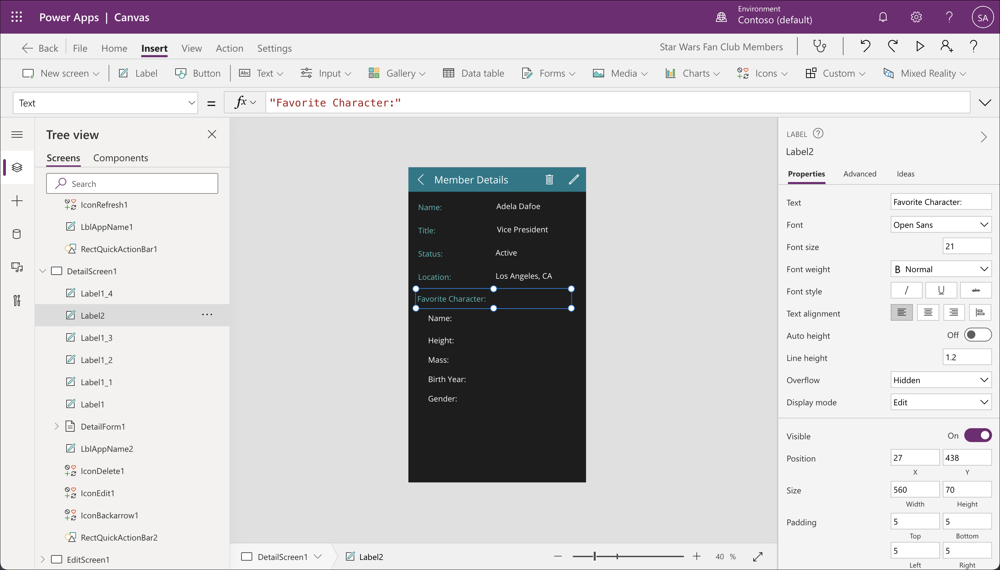

### Task 4.4: Connect the Detail Screen to the Star Wars API

1. In the left pane, select the **Tree view** and then the **BrowseGallery1** on **Browsescreen1**.

2. Using the drop-down menu, select the **OnSelect** action that will be executed when a user selects a Fan Club member from the gallery.

3. In the **OnSelect** function, we will navigate to **DetailScreen1** and call the Star Wars API to get the character details for the member&#39;s favorite character.

    ```
    Navigate(DetailScreen1, ScreenTransition.None);

    ClearCollect(characterCollection, StarWars.getpeople({search: ThisItem.MemberFavoriteCharacter}).results);
    ```
    
    

### Task 4.5: Show the Star Wars character information on the Detail Screen

1. For each of the description labels on **DetailScreen1** , change the **Text** property in the right-side **Properties** panel to include the data from the API. For example, for the **Name:** label: `&quot;Name:&quot; &amp; &quot; &quot; &amp; First(characterCollection).name`

    - Select `Name` Label and Enter `"Name: " & First(characterCollection).name`

       

    - Likewise, you can enter the following for each label:
    - Mass: `"Mass: " & Text(First(characterCollection).mass, "[$-en-US]0") & " kg"`
    - Height: `"Height: " & Text(First(characterCollection).height, "[$-en-US]0") & " cm"`
    - Birth year: `"Birth Year: " & First(characterCollection).birth_year`
    - Gender: `"Gender: " & First(characterCollection).gender`
   
2. Select **Play** in the upper-right corner to practice using the app.
 
   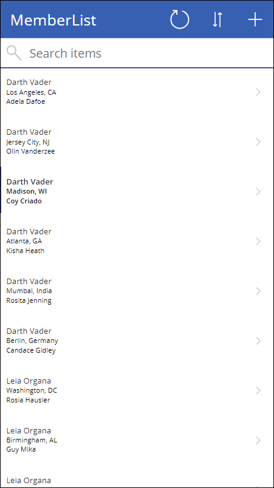

   

--- 

### Summary
In this exercise, you have integrated the Star Wars API with Azure API Management, exported it as a Power Platform Custom Connector, and created a Canvas App to allow Fan Club members to search and view information about their favorite Star Wars characters.

- Now, click on Next from the lower right corner to move on to the next page.
