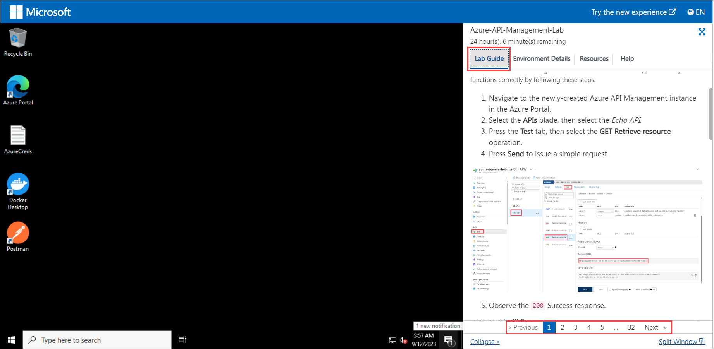

# Azure API Management
---
#### Overall Estimated Duration: 7 Hours

## Overview
The purpose of this lab is to enhance your coding workflow by leveraging Azure’s API Management tools. You will gain hands-on experience in setting up and verifying an API Management instance, deploying and customizing the Developer Portal, and managing user experience and product definitions. The lab will guide you through creating and integrating APIs, working with existing APIs like the Star Wars API, importing APIs using OpenAPI, and managing testing, subscription keys, and rate limits. Additionally, you’ll configure policy expressions, handle API versions and revisions, implement analytics and monitoring tools, and establish security measures. The integration of Fusion Dev tools and the design of a scalable, secure API management architecture will also be covered, equipping you with the skills to optimize your API development and management processes effectively.

## Objective
By the end of this lab, you will improve your coding workflow by leveraging AI-powered tools. You will:
   - **Create an API Management Instance**: Set up and verify an Azure API Management instance in your environment.
   - **Developer Portal**: Deploy and customize the Developer Portal, configure email settings, and manage user experience and product definitions.
   - **Adding APIs**: Create new APIs, integrate with existing ones (e.g., Star Wars API), import APIs using OpenAPI, and manage testing, subscription keys, and rate limits.
   - **Policy Expressions**: Configure and implement policy expressions to control API behavior and enforce rules.
   - **Version and Revisions**: Handle API versions and revisions for updates and compatibility.
   - **Analytics & Monitoring**: Implement tools for tracking API performance and usage.
   - **Security**: Integrate and utilize Fusion Dev tools for enhanced API management and development.
   - **Fusion Dev**: Integrate and utilize Fusion Dev tools for enhanced API management and development.
   - **Architecture Design Session**: Design and plan the architecture of your API Management setup, focusing on scalability, security, and performance.

## Pre-requisites
   - **Azure Account**: An active Azure account with permissions to create and manage resources.
   - **Basic API Knowledge**: Understanding of API concepts such as endpoints, operations, and HTTP methods.
   - **API Management Familiarity**: Basic knowledge of API management tools and concepts.
   - **Programming Skills**: Proficiency in a programming language (e.g., Python, JavaScript, C#) to work with APIs and integrations.
   - **OpenAPI Specification**: Familiarity with OpenAPI specifications for importing APIs.
   - **Web Development Knowledge**: Understanding of web technologies and concepts for customizing the Developer Portal.
   - **Security Fundamentals**: Basic knowledge of API security practices and measures.
   - **Analytics Understanding**: Familiarity with analytics and monitoring tools for tracking API performance.
   - **Fusion Dev Tools**: Basic knowledge of Fusion Dev tools for API management and development.

## Architecture

## Architecture Diagram

## Explanation of Components

# Getting Started with Lab

1. Once the environment is provisioned, a virtual machine (JumpVM) and lab guide will get loaded in your browser. Use this virtual machine throughout the workshop to perform the lab. You can see the number on the bottom of lab guide to switch to different exercises of the lab guide.

   

1. To get the lab environment details, you can select the **Environment Details** tab. Additionally, the credentials will also be emailed to your registered email address. You can also open the Lab Guide on separate and full window by selecting the **Split Window** from the lower right corner. Also, you can start, stop, and restart virtual machines from the **Resources** tab.

   
 
    > You will see the DeploymentID value on **Environment Details** tab, use it wherever you see SUFFIX or DeploymentID in lab steps.

## Login to Azure Portal

1. In the JumpVM, click on Azure portal shortcut of Microsoft Edge browser which is created on desktop.

   
   
1. On **Sign into Microsoft Azure** tab you will see login screen, in that enter following email/username and then click on **Next**. 
   * Email/Username: <inject key="AzureAdUserEmail"></inject>
   
     
     
1. Now enter the following password and click on **Sign in**.
   * Password: <inject key="AzureAdUserPassword"></inject>
   
     
     
      >**Note**: If you see the **Action Required** dialog box, then select **Ask Later** option.

      
  
1. If you see the pop-up **Stay Signed in?**, click No

1. If you see the pop-up **You have free Azure Advisor recommendations!**, close the window to continue the lab.

1. If a **Welcome to Microsoft Azure** popup window appears, click **Cancel** to skip the tour.
      
1. Now, click on the **Next** from lower right corner to move on next page.

## Support Contact
 
1. The CloudLabs support team is available 24/7, 365 days a year, via email and live chat to ensure seamless assistance at any time. We offer dedicated support channels tailored specifically for both learners and instructors, ensuring that all your needs are promptly and efficiently addressed.
 
   Learner Support Contacts:
 
   - Email Support: labs-support@spektrasystems.com
   - Live Chat Support: https://cloudlabs.ai/labs-support
 
1. Now, click on Next from the lower right corner to move on to the next page.

## Happy Learning!!