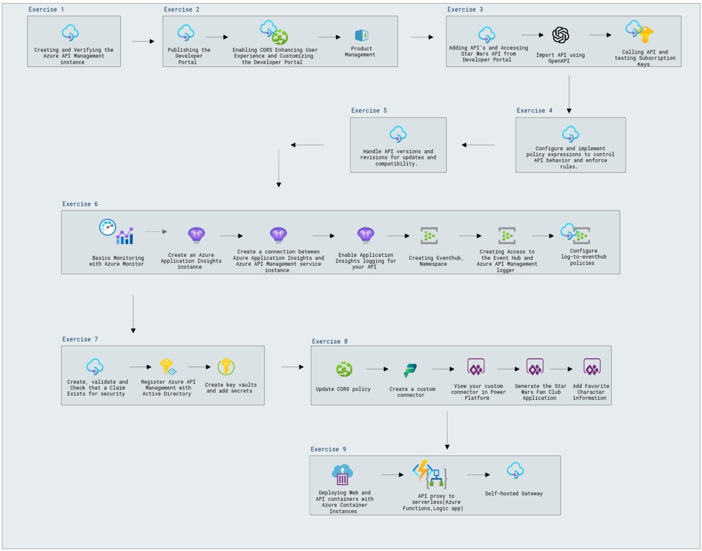
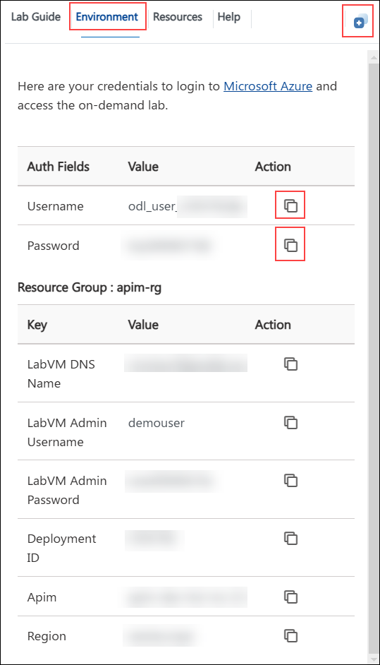

# Azure API Management

## Overall Estimated Duration: 7 Hours

## Overview

The purpose of this lab is to enhance your coding workflow by leveraging Azure’s API Management tools. You will gain hands-on experience in setting up and verifying an API Management instance, deploying and customizing the Developer Portal, and managing user experience and product definitions. The lab will guide you through creating and integrating APIs, working with existing APIs like the Star Wars API, importing APIs using OpenAPI, and managing testing, subscription keys, and rate limits. Additionally, you’ll configure policy expressions, handle API versions and revisions, implement analytics and monitoring tools, and establish security measures. The integration of Fusion Dev tools and the design of a scalable, secure API management architecture will also be covered, equipping you with the skills to optimize your API development and management processes effectively.

## Objective

Understand how to leverage Azure’s API Management tools to enhance your coding workflow. Gain hands-on experience in setting up API instances, managing user interactions, and optimizing API performance and security. By the end of this lab, you will be able to:

   - **Verify API Management Instance**: Set up and verify an Azure API Management instance in your environment. 
     Learn how to configure basic settings and ensure the instance is properly integrated with your Azure resources.
   - **Developer Portal**: Deploy and customize the Developer Portal to match your organization’s branding and 
     requirements. Configure email settings, manage user experience, and create product definitions for your API 
     offerings.
   - **Adding APIs**: Create new APIs and integrate them with existing APIs, such as the Star Wars API, to enhance 
     functionality. Import APIs using OpenAPI specifications, and manage aspects like testing, subscription keys, and 
     rate limits to ensure seamless operation.
   - **Policy Expressions**: Configure and implement policy expressions to control API behavior, enforce security 
     rules, 
     and handle transformations. Learn to write custom policies to tailor API responses and request handling as per 
     business requirements.
   - **Version and Revisions**: Handle API versions and revisions effectively to maintain backward compatibility and 
     manage updates. Learn best practices for versioning strategies to ensure smooth transitions and minimal disruption 
     to users.
   - **Analytics & Monitoring**: Implement and utilize tools for tracking API performance and usage, and generate 
     insightful reports. Set up monitoring to detect anomalies, analyze trends, and optimize API performance based on 
     real-time data.
   - **Security**: Integrate security measures such as OAuth, JWT, and IP restrictions to protect your APIs from 
     unauthorized access. Implement robust authentication and authorization practices to safeguard sensitive data and 
     ensure secure interactions.
   - **Fusion Dev**: Utilize Fusion Dev tools to enhance API management, streamline development workflows, and automate 
     tasks. Explore features that support API lifecycle management and improve collaboration within development teams.
   - **Architecture Design Session**: Design and plan the architecture of your API Management setup with a focus on 
     scalability, security, and performance. Develop a comprehensive strategy to address potential challenges and 
     optimize the infrastructure for future growth.

## Pre-requisites

   - **Azure Account**: An active Azure account with permissions to create and manage resources.
   - **Basic API Knowledge**: Understanding of API concepts such as endpoints, operations, and HTTP methods.
   - **API Management Familiarity**: Basic knowledge of API management tools and concepts.
   - **Programming Skills**: Proficiency in a programming language (e.g., Python, JavaScript, C#) to work with APIs and 
     integrations.
   - **OpenAPI Specification**: Familiarity with OpenAPI specifications for importing APIs.
   - **Web Development Knowledge**: Understanding of web technologies and concepts for customizing the Developer Portal.
   - **Security Fundamentals**: Basic knowledge of API security practices and measures.
   - **Analytics Understanding**: Familiarity with analytics and monitoring tools for tracking API performance.
   - **Fusion Dev Tools**: Basic knowledge of Fusion Dev tools for API management and development.

## Architecture

The architecture uses Azure API Management to manage and secure APIs. It includes setting up an API Management instance to handle and direct API requests while applying policies like rate limits and CORS for secure access. The Developer Portal is customized to offer easy-to-use API documentation, testing, and subscription features. APIs are hosted on Azure App Services or AKS, with security managed through Azure Key Vault and authentication methods. Analytics tools like Azure Monitor track performance, and Azure Logic Apps and CDN are used to improve integration and content delivery. This setup ensures a secure, scalable, and user-friendly API management system.

## Architecture Diagram

## Explanation of Components

1. **Azure API Management Instance**: Central hub for managing and securing APIs. It directs API traffic, applies policies, and ensures smooth operation.

2. **API Gateway**: Routes requests to backend services and enforces rules like rate limiting and CORS (Cross-Origin Resource Sharing) for secure API access.

3. **Developer Portal**: User-friendly interface for developers to access API documentation, test APIs, and manage subscriptions.

4. **Azure Functions**: Executes serverless code in response to events, useful for processing or integrating with other services.

5. **Azure Key Vault**: Stores sensitive information like API keys and certificates securely.

6. **JWT (JSON Web Tokens)**: Manages user authentication and permissions to ensure secure API access.

7. **Azure Monitor and Application Insights**: Tracks API performance and provides alerts for monitoring and optimization.

8. **Azure Logic Apps**: Automates workflows and integrates with other services based on API events.

## Getting Started with Lab

1. Once the environment is provisioned, a virtual machine (JumpVM) and lab guide will get loaded in your browser. Use this virtual machine throughout the workshop to perform the lab. You can see the number on the bottom of lab guide to switch to different exercises of the lab guide.

   

1. To get the lab environment details, you can select the **Environment Details** tab. Additionally, the credentials will also be emailed to your registered email address. You can also open the Lab Guide on separate and full window by selecting the **Split Window** from the lower right corner. Also, you can start, stop, and restart virtual machines from the **Resources** tab.

   
 
    > You will see the DeploymentID value on **Environment Details** tab, use it wherever you see SUFFIX or DeploymentID in lab steps.

## Login to Azure Portal

1. In the JumpVM, click on Azure portal shortcut of Microsoft Edge browser which is created on desktop.

   
   
1. On **Sign into Microsoft Azure** tab you will see login screen, in that enter following email/username and then click on **Next**. 
   * Email/Username: <inject key="AzureAdUserEmail"></inject>
   
     
     
1. Now enter the following password and click on **Sign in**.
   * Password: <inject key="AzureAdUserPassword"></inject>
   
     
     
      >**Note**: If you see the **Action Required** dialog box, then select **Ask Later** option.

      
  
1. If you see the pop-up **Stay Signed in?**, click No

1. If you see the pop-up **You have free Azure Advisor recommendations!**, close the window to continue the lab.

1. If a **Welcome to Microsoft Azure** popup window appears, click **Cancel** to skip the tour.
      
1. Now, click on the **Next** from lower right corner to move on next page.

## Support Contact
 
1. The CloudLabs support team is available 24/7, 365 days a year, via email and live chat to ensure seamless assistance at any time. We offer dedicated support channels tailored specifically for both learners and instructors, ensuring that all your needs are promptly and efficiently addressed.
 
   Learner Support Contacts:
 
   - Email Support: cloudlabs-support@spektrasystems.com
   - Live Chat Support: https://cloudlabs.ai/labs-support
 
1. Now, click on Next from the lower right corner to move on to the next page.

## Happy Learning!!
